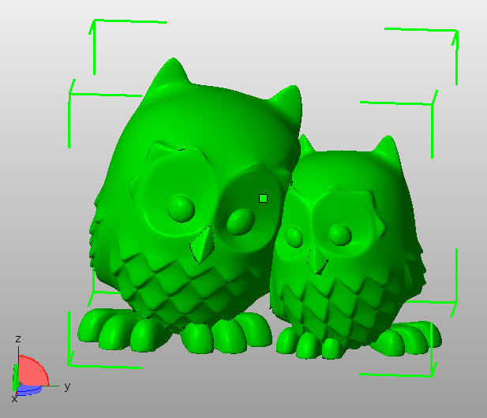

Programová manipulace s STL soubory
===================================

Kromě ručního zpracování meshe v programech, jako je Netfabb Basic,
je možné mesh zpracovávat i programově – tedy vytvářet programy, které s meshí
něco více či méně zajímavého provádějí.
Protože jsme na Fakultě informačních technologií, byla by škoda tento přístup
neprozkoumat.

Možnosti zpracování meshe ve formátu STL
----------------------------------------

Formát STL je velmi jednoduchý. Jeho popis najdete ve [cvičení, které se věnuje
meshi a chybám v ní](./mesh.md). Načítat a ukládat soubory ve formátu STL není
tedy žádná raketová věda, ale jedná se o poměrně nudné programování.

Naštěstí již existují hotové open-source knihovny, které toto řeší za nás.

Knihoven je celá řada, najít vhodnou knihovnu pro vás oblíbený jazyk je otázka
několika vteřin vyhledávání na internetu. Zde namátkou zmíním:

-   [numpy-stl](https://pypi.python.org/pypi/numpy-stl) pro Python + NumPy
-   [STLdotNET](https://github.com/QuantumConcepts/STLdotNET) pro C#
-   [STL-Loader](https://github.com/cpedrinaci/STL-Loader) pro Javu
-   …

My budeme používat knihovnu [ADMesh][admesh], která je napsaná v jazyce C, dá se
jednoduše použít v jazyce C++, existují bindingy pro jazyky Python a Ruby.

ADMesh
------

[ADMesh][admesh] je open-source program, který umožňuje manipulovat s STL meshí 
z příkazové řádky. Kromě rozhraní pro příkazovou řádku je k dispozici také
knihovní API, které ale původně nevzniklo s úmyslem znovupoužitelnosti,
takže je mnohdy jeho použití neintuitivní.

### Příklad: Převod z ASCII do binárního STL a obráceně

Zde je na ukázku krátký program, který načte STL soubor `model.stl`
(binární nebo ASCII) a zapíše jej jako ASCII nebo binární STL do stejného
souboru – z binárních dělá ASCII a z ASCII dělá binární.

```c
#include <stdlib.h>
#include <admesh/stl.h>
 
int main(void) {
  stl_file stl_in;
  char *filename = "model.stl";
 
  printf("Opening %s\n", filename);
  stl_open(&stl_in, filename);
  stl_exit_on_error(&stl_in);
 
  if (stl_in.stats.type == binary) {
    printf("Writing ASCII file %s\n", filename);
    stl_write_ascii(&stl_in, filename, "ADMesh");
    stl_exit_on_error(&stl_in);
  } else {
    printf("Writing binary file %s\n", filename);
    stl_write_binary(&stl_in, filename, "ADMesh");
    stl_exit_on_error(&stl_in);
  }
 
  stl_close(&stl_in);
  return EXIT_SUCCESS;
}
```

Všimněte si, že:

-   funkce přijímají jako první argument ukazatel na strukturu `stl_file`
-   po každém volání IO funkce je korektní volat `stl_exit_on_error()`, 
    jinak můžete dostat SEGFAULT
-   na konci se sluší volat `stl_close()`

Program se kompiluje pomocí:

```console
$ gcc source.c -ladmesh -o myapp
```

Případně, pokud nemáte ADMesh nainstalovaný ve standardních cestách:

```console
$ gcc -L/cesta/k/adresáři/knihovnou -I/cesta/k/adresáři/s/hlavičkovým/souborem source.c -ladmesh -o myapp
```

Výsledný program spustíte příkazem:

```console
$ ./myapp
```

Na některých systémech musíte použít:

```console
$ LD_LIBRARY_PATH=/usr/local/lib ./myapp
```

Pro ty méně šťastné z vás, používající Windows, bohužel oficiální instrukce
neznáme, máme ale nějaké
[screenshoty pro NetBeany](https://edux.fit.cvut.cz/courses/BI-3DT/tutorials/admesh/win)
od studentů.

Jednotlivé funkce a struktury najdete v souboru
[`admesh/stl.h`](https://github.com/admesh/admesh/tree/master/src/stl.h).
Velkou dokumentací knihovna bohužel neoplývá, i když něco vzniká na
[admesh.readthedocs.io](http://admesh.readthedocs.io/en/latest/).

Úloha
-----

Za tři body na cvičení naprogramujte program v jazyce C, C++,
[Python](https://pypi.python.org/pypi/admesh) nebo
[Ruby](https://rubygems.org/gems/radmesh/),
který pro zadaný STL soubor (první argument volání programu) najde nejvhodnější
rotaci kolem osy Z tak, aby plocha obdélníkové podstavy pomyslného opsaného
hranolu objektu byla co nejmenší – hrany pomyslného opsaného hranolu jsou
rovnoběžné s osami X, Y nebo Z.

Pokud chcete použít Python na školním počítači, musíte udělat (případně použít
virtualenv):

```console
$ pip3 install --user admesh
```

Ilustrační obrázek z Netfabbu ukazující opsaný hranol s obdélníkovou podstavou:



Program vypíše na standardní výstup úhel otočení (ve stupních), obsah postavy
opsaného hranolu, a do souboru zadaného druhým argumentem (z příkazové řádky)
uloží orotovaný soubor v takovém formátu (ASCII/binary), v jakém byl načten
vstupní soubor.

Pro ukázku můžete použít následující STL, ale program musí umět pracovat s 
jakýmkoliv STL.

-   [hellskull.stl](../stls/hellskull.stl) 
    ([CC BY-ND Ola Sundberg](https://www.thingiverse.com/thing:479949))

Vhodný úhel nalezněte bruteforce metodou pro úhly otočení v násobcích 5°
(5°, 10°, 15°, ...).

Vhodné funkce a údaje:

-   `stl_rotate_z(&stl_in, angle_in_degrees)` – rotuje kolem osy Z, o daný 
    počet stupňů
-   `<stl_file>.stats.number_of_facets` je počet trojúhelníků v STL
-   `<stl_file>.facet_start` je ukazatel na první trojúhelník (a jde k němu 
    přistupovat jako k poli)
-   trojúhelníky jsou uloženy v strukturách `stl_facet` obsahující v 
    trojprvkovém poli `vertex` tři vrcholy (struktura `stl_vertex` obsahující 
    tři floaty `x`, `y` a `z`)
-   zajímavé údaje jsou uloženy i ve `stl_file.stats`
  
[admesh]: https://github.com/admesh/admesh
