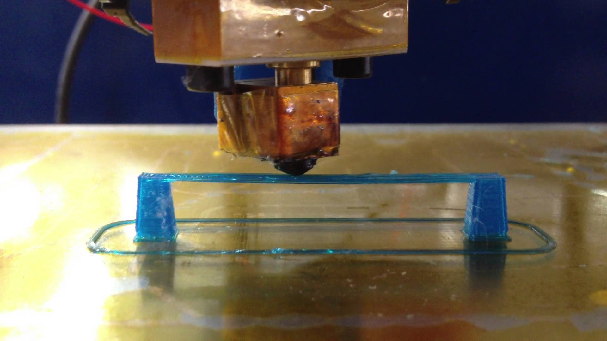

# Mosty

Pro tisk přemostění je důležité mít správně nastavený profil ve sliceru. Správný most by měl vypadat jako na obrázku níže. Není žádoucí, aby byl most prověšený, nebo aby měl přetrhaná vlákna.

(Obrázek z [videa](https://www.youtube.com/watch?v=wK2APNwEoSk) © BCN3D Technologies.)

## Správně nastavený most

Pro kalibraci mostu se upravuje hodnota v aplikaci Slic3r v sekcích:

 -  Print Settings→Speed→Bridges 
 -  Print Settings→Advanced→Flow.

Pro dnešní cvičení si stáhnětě nový [config](../configs/bridges/slic3r_config_bundle.ini)
