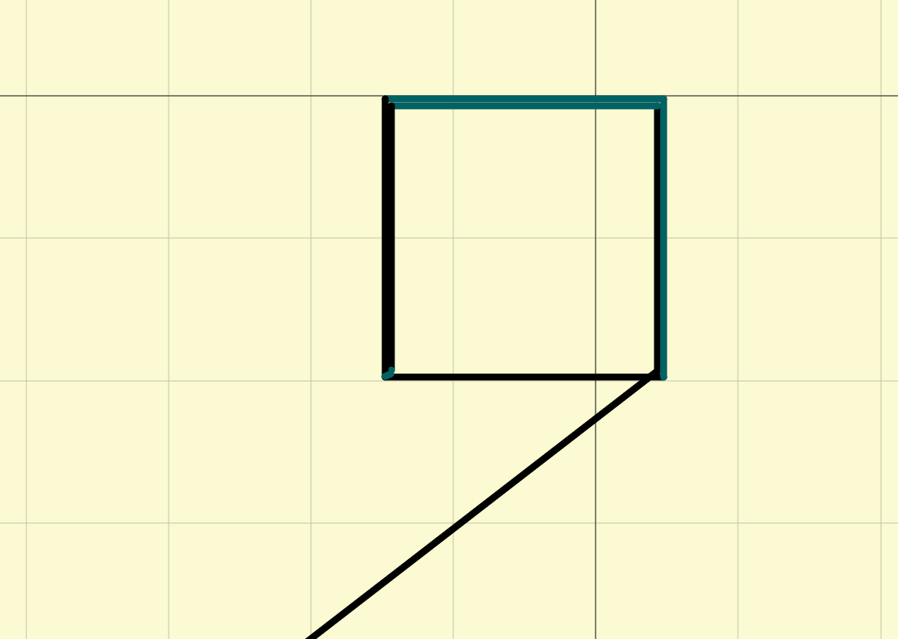

GCode
=====

GCode obecně
------------

-   G-Code = GCode = gcode = GCODE
-   Jazyk pro ovládání CNC zařízení
-   Po seriové lince jsou posílány příkazy v textové podobě
-   Detailní popis na [RepRap wiki](http://reprap.org/wiki/G-code)

Příklad:

```gcode
  G92 E0
  G28
  G1 F1500.0*82
  G1 X2.0 Y2.0 F3000.0*85
  G1 X3.0 Y3.0*33
```

Základní kategorie příkazů
--------------------------

-   Gnn - Standardní GCode příkaz
    -   pohyb na určité místo  - G0,G1
    -   nastavení pozice - G92
    -   nastavení jednotek - G20,G21
-   Mnn - RepRap-defined příkaz
    -   zastavení, uspání tiskárny
    -   přístup na SD kartu
    -   zapnutí/vypnutí chlazení
    -   atd.
-   Tnn - Select tool
    -   Výběr nástroje - například výměna extruderu

Buffered/UNbuffered příkazy
---------------------------

Po přijetí každého příkazu elektronikou je odesláno potvrzení, že byl příkaz 
proveden/správně přijat.

Buffered
--------

Příkazy jsou okamžitě označovány za potvrzené/provedené a uloženy v lokální 
paměti zařízení (závisí na elektronice kolik příkazů se vejde do paměti). 
Vzniká tedy prodleva mezi tím co ukazuje ovládací software a co tiskárna 
skutečně dělá za příkaz.

Zástupci:  
-   G0 - Rapid move
-   G1 - Controlled move
-   G28 - Move to Origin
-   G29-G32 - Z-Probe [Ukázka](https///www.youtube.com/watch?v=a0uV6PBz_w4)

UnBuffered
----------

Příkazy jsou přijaty elektronikou, ale nejsou potvrzeny dokud nejsou 
provedeny tiskárnou. 

Zástupci jsou hlavně M a T příkazy.

Příklad:

```gcode
    M106 ;zapnuti vetraku
    M99 ;reset tiskarny
```

Ukázka
------

```gcode
    G1 X104.322 Y80.678 F1365.000 E0.28619 ; perimeter
    G1 X104.322 Y99.322 E0.28618 ; perimeter
    G1 X85.678 Y99.322 E0.28618 ; perimeter
    G1 X85.678 Y80.746 E0.28514 ; perimeter
    G1 X85.226 Y80.226 F7800.000 ; move to first perimeter point
    G1 X104.774 Y80.226 F955.500 E0.30006 ; perimeter
    G1 X104.774 Y99.774 E0.30006 ; perimeter
    G1 X85.226 Y99.774 E0.30006 ; perimeter
    G1 X85.226 Y80.294 E0.29902 ; perimeter
    G1 X85.618 Y80.452 F7800.000 ; move inwards before travel
```



Prohlížení
----------

GCode můžete prohlížet v programu 
[Pronterface](tutorials/tisk/start#pronterface). Po spuštění zvolte z horního 
panelu **Load file** a zvolte požadovaný .gcode soubor. Až se načte, klepněte 
do části uprostřed. Pokud máte zapnuté 3D zobrazení, musíte použít dvojklik.
