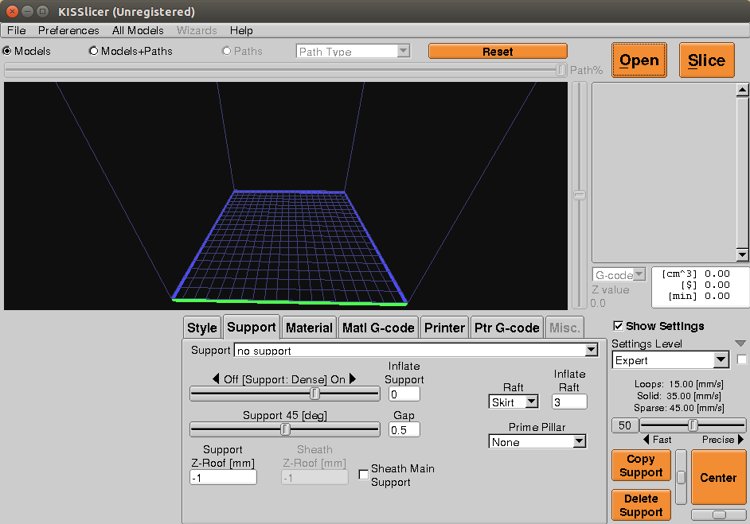
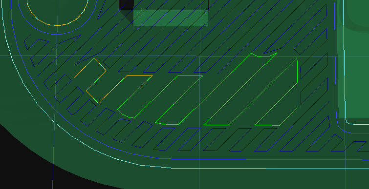

KISSlicer
=========

Program KISSlicer
-----------------

-   Keep It Sipmle Slicer
-   FREE/PRO varianta
-   Více na [Webu projektu](http://kisslicer.com)

Ukázka
------

Popis rozhraní
--------------

-   Style - Tiskový styl určující výplň a tloušťku stěn
-   Support - Podpůrný materiál
-   Material - nastavení teplot, chlazení, ceny materiálu a "Destring"
-   Matl G-Code - Specifický kód pro materiál (pro nás nedůležité)
-   Printer - Nastavení parametrů tiskárny včetně rychlostí
-   Ptr G-code - Možnost vlastního kódu při sestavování tiskové dávky

Rozdíly oproti Slic3r
---------------------

-   Nevyžaduje nastavení průměru trysky
-   Méně možností nastavení rychlosti
-   Nastavení tloušťka stěny

Tloušťka stěny
--------------

-   Nastaveno v mm
-   V celém objektu je počítáno s tloušťkou stěny podle zadané hodnoty
-   Obvody jsou doplněny 100% výplní

Extrusion Width/Thickness
-------------------------

-   Možnost nastavit výšku vrstvy a tloušťku "čáry"
-   Výhodou/Nevýhodou je nastavení přímo v mm, namísto poměru vůči výšce
