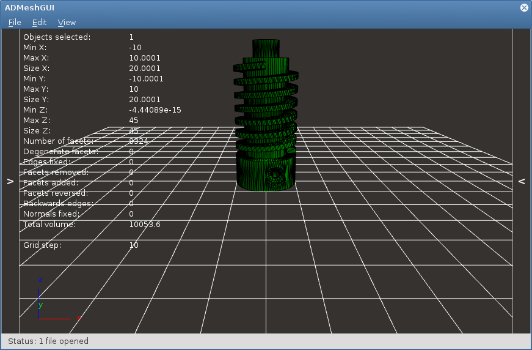
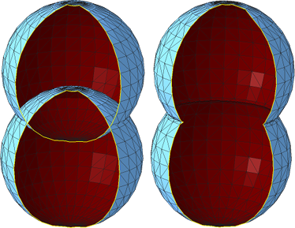

Práce s 3D modely ve formě meshí
================================

Triangulární mesh
-----------------

Existuje mnoho způsobů, jak reprezentovat 3D modely. Například [CSG strom],
jako v OpenSCADu, případně různé objemové oktalové reprezentace apod.

[CSG strom]: https://en.wikipedia.org/wiki/Constructive_solid_geometry

Pro 3D tisk se však nejčastěji používá **hraniční reprezentace**, konkrétně
triangulární mesh (nebo lépe česky trojúhelníková síť). Mesh je kolekce bodů,
hran a stěn (polygonů a facetů) ve trojrozměrném kartézském souřadném systému.
Existuje několik různých druhů takové meshe, my se budeme zabývat výhradně
meshí triangulární, kde facetem může být pouze trojúhelník. Výhoda trojúhelníku
ve 3D prostoru je, že tři body, neležící na jedné přímce, vždy tvoří
trojúhelník (4 body nemusí v trojrozměrném prostoru ležet v jedné rovině a
tvořit čtyřúhelník).


_Obrázek upraven z [Wikipedie](https://commons.wikimedia.org/wiki/File:Mesh_overview.svg)._

Jednotlivé facety tvoří „vodotěsnou“ hranici mezi vnitřkem a vnějškem 3D modelu.


Na rozdíl od CSG stromu se mesh vyznačuje tím, že nenese informace o významu
(není například parametrická), na druhou stranu je velmi rychlé ji vykreslit,
nebo dále zpracovávat. V kontextu OpenSCADu můžete vnímat mesh jako výsledek
kompilace.

Formát STL
----------

Triangulární mesh lze ukládat v různých formátech. Nejpoužívanějším formátem
pro FDM 3D tisk je **formát STL** (mezi další patří OBJ, AMF, 3MF a další).
STL znamená _STereoLitography_ a je to formát vyvinutý společností _3D Systems_
v roce 1987 jako univerzální formát pro rapid prototyping.

Později se objevily významy zkratky jako _Standard Triangle Language_ nebo
_Standard Tessellation Language_.

Soubor ve formátu STL obsahuje seznam trojúhelníkových facetů, jejich vrcholů
a normál. Existuje lidsky čitelná [ASCII] a úspornější [binární] varianta.

Formát STL není otevřeným formátem, ale je velmi rozšířen, podporuje jej mnoho
programů nejen ze světa 3D tisku.

[ASCII]: http://en.wikipedia.org/wiki/STL_(file_format)#ASCII_STL
[binární]: http://en.wikipedia.org/wiki/STL_(file_format)#Binary_STL

### ASCII STL soubor

Syntaxe textového STL souboru je poměrně upovídaná. Začíná klíčovým slovem
`solid` a názvem meshe (který není často využívám a bývá nahrazován názvem
programu, který byl použit k vygenerování souboru). Poté následuje definice
všech facetů a soubor končí direktivou `endfacet` a opět názvem meshe.

(Soubor teoreticky může obsahovat více bloků `solid`, ale v praxi se s tím
často nesetkáte.)

Jeden facet obsahuje informaci o normálovém vektoru a o třech vrcholech.

```stl
solid name

facet normal ni nj nk
    outer loop
        vertex v1x v1y v1z
        vertex v2x v2y v2z
        vertex v3x v3y v3z
    endloop
endfacet

...

endsolid name
```

Pořadí vrcholů facetu musí splňovat pravidlo pravé ruky: Jestliže palce ukazuje
ve směru normály (tedy ven z objektu), stočené prsty udávají pořadí vrcholů.


Jednotlivá čísla se dají reprezentovat jak pomocí notace čísel s plovoucí
desetinou čárkou, tak „lidštějším zápisem“, můžete se tak setkat např.
s hodnotami `1`, `0.5` nebo `2.648000e-002`.

Zde je reálný příklad kostky z OpenSCADu:

```stl
solid OpenSCAD_Model
  facet normal -1 0 0
    outer loop
      vertex 0 0 1
      vertex 0 1 1
      vertex 0 0 0
    endloop
  endfacet
...
  facet normal 1 0 0
    outer loop
      vertex 1 0 1
      vertex 1 0 0
      vertex 1 1 1
    endloop
  endfacet
endsolid OpenSCAD_Model
```


[Binární STL soubor][binární] obsahuje stejné informace, pouze v úspornější
podobě.
Čísla jsou reprezentována datovým typem `float32` v pořadí little endian.

Prohlížení STL souborů
----------------------

STL soubory lze prohlížet v mnoha programech:

  * `cat` a `hexdump` pro ty s velkou představivostí 😎
  * [ADMeshGUI](https://github.com/admesh/ADMeshGUI/) (Linux, macOS, Windows)
  * [STLView](http://www.freestlview.com/) (Windows)
  * [Pleasant3D](http://www.pleasantsoftware.com/developer/pleasant3d/) (macOS)
  * nástroje na úpravu meshe jako [MeshLab] nebo [Netfabb]
  * modelovací nástroje jako [Blender] apod.

[MeshLab]: http://www.meshlab.net/
[Netfabb]: https://github.com/3DprintFIT/netfabb-basic-download
[Blender]: https://www.blender.org/



Chyby v triangulární meshi
--------------------------

I syntakticky naprosto správný STL soubor nemusí sémanticky dávat vůbec smysl.
Mnoho STL souborů může vlivem různých faktorů obsahovat řadu chyb.
O meshi, která obsahuje chyby, se říká, že je nevalidní.

Zde si představíme několik častých chyb v STL souborech:

### Neuzavřená mesh / díra v meshi

Mesh není „vodotěsná“ a někde obsahuje díru.


Často díra není způsobena chybějícím facetem, ale nepřesností v číslech
s plovoucí desetinnou čárkou s malou přesností.


### Duplicitní facet

Na stejném místě se nachází více facetů.
Někdy jsou stejně orientované a plně se překrývají, jindy můžou takové facety
tvořit část modelu s nulovým objemem.


### Špatně orientovaný facet

Orientace facetu je dána pořadím vrcholů a normálou. Tyto informace si tedy mohou protiřečit. Někdy je také část 3D modelu nebo celý model otočen „vnitřkem ven“.


### Sdílená hrana či stěna

Na první pohled nevinná chyba, která ale rozporuje fyzické reprezentaci 3D
modelu. Je mezi těmito kostkami úzká mezera, nebo jde úzkou mezerou projít
z jedné kostky do druhé?


### Protínající se facety

Při spojování více skořepin často vniká chyba, kdy se facety navzájem protínají.

Na obrázku jsou nesprávně (vlevo) a správně (vpravo) spojené koule, díra v meshi je zde jen pro lepší náhled dovnitř.




Oprava chyb v triangulární meshi
--------------------------------

Existuje mnoho programů, které umožňují výše zmíněné chyby opravovat.
Někdy jde o programy na modelování, které „navíc“ umožňují takové chyby
detekovat a poloautomaticky opravovat, někdy jde o specializované programy.

### Blender

Z první kategorie zmíníme program Blender, který obsahuje nástroje k opravě a
anylýze meshí. Existuje i
[výukové DVD](https://store.blender.org/product/blender-for-3d-printing/)
pro Blender zabývající se 3D tiskem. Pro studenty FIT ČVUT jej máme k dispozici.

### ADMesh

Mezi programy, které se snaží automaticky opravovat chyby v triangulární meshi
patří command line nástroj [ADMesh](http://github.com/admesh/admesh) či výše
zmíněná  grafická nadstavba [ADMeshGUI](https://github.com/admesh/ADMeshGUI).
Výsledky ale nejsou příliš dobré.

### Netfabb Basic

Nejlepší zkušenost s opravou meshí máme v programu **Netfabb Basic**.
Bohužel tento program není open source a již nadále neexistuje.

Pro Windows lze použít
[trail verzi programu Netfabb](https://www.autodesk.com/products/netfabb/free-trial),
která se po vypršení chová jako Netfabb Basic.

Pro ostatní platformy lze využít
[naše zálohy programu Netfabb Basic](https://github.com/3DprintFIT/netfabb-basic-download),
které jsou volně šiřitelné.

Na cvičení používáme tento program.

TODO zde bude video s opravou kostky a krokodýla


Soubory
-------

  * [cube_bad.stl](../stls/mesh/cube_bad.stl) – kostka z videa s chybami
  * [cube_correct.stl](../stls/mesh/cube_correct.stl) – kostka z videa bez chyb
  * [aligator_mini_bad.stl](../stls/mesh/aligator_mini_bad.stl) – aligátor z videa ([originál CC BY-SA Joseph Larson](https://www.thingiverse.com/thing:21724))
  * [bunny_trouble_piece.stl](../stls/mesh/bunny_trouble_piece.stl) – králík z videa ([CC BY-NC mrbug](https://www.thingiverse.com/thing:7578))
  * [base_simple.stl](../stls/mesh/base_simple.stl) – bodovaná úloha na cvičení
  * [stojan_broken.stl](../stls/mesh/stojan_broken.stl) – bodovaná úloha na cvičení
  * [vicko.stl](../stls/mesh/vicko.stl) – bodovaná úloha na cvičení
  * [tajmahal.stl](../stls/mesh/tajmahal.stl) – nebodovaná úloha na procvičení ([CC BY-SA Nicholas Wilson](https://www.thingiverse.com/thing:11183))

