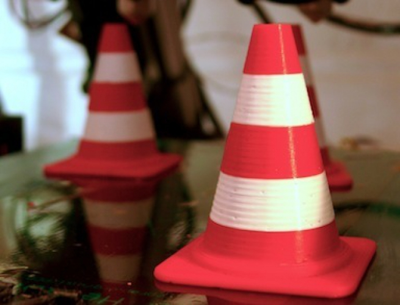
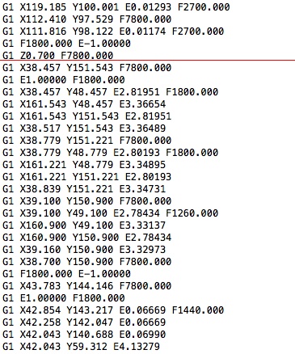

# Vícebarevný/vícemateriálový tisk

Pokud vlastníme tiskárnu s pouze jednou tryskou (jako dnes většina),
je pro nás tisk z více materiálů zároveň téměř nedostupný, nebo alespoň velice obtížný.
Obtížná není až tak výměna samotného materiálu (teoreticky se jedná pouze o pozastavení
tisku a následné navázání s novým materiálem), ale „ukočírování“ tiskárny.

## Postupy

Existují dva možné přístupy (námi vyzkoušené) jak vytisknout vícebarevný objekt s
jednou tryskou. V obou případech předpokládejme, že chceme vytisknout dopravní kužel.

### Postup 1 - rozdělení tisku

Rozdělení tisku na více částí myslíme rozdělení samotného GCode na více souborů.

 -  Necháme si vygenerovat GCode celého kuželu
 -  Najdeme příhodnou vrstvu kdy chceme aby končila jedna barva a rozdělíme na dva soubory
 -  Opakujeme předchozí krok tolikrát kolikrát se mění barvy
 -  Do každého nově vzniklého GCode přidáme na začátek a na konec příkaz G28 X0 Y0
 -  Spustíme tisk prvního souboru
 -  Až dotiskne první barva, můžeme zavést novou a spustit další soubor
 -  Opakujeme dokud nedotiskneme celý objekt

### Postup 2 - rozdělení modelu

Rozdělení samotného modelu na více barevných částí. Vyžaduje bohužel přidání „kotvítka“,
které je umístěno vždy na stejném místě v nulté vrstvě.

 -  Rozdělíme model na více částí podle barev
 -  Z každého modelu vytvoříme samostatný GCode
 -  Spustíme první tiskovou dávku
 -  Po dotisknutí odstraníme „kotvítko“
 -  Vyměníme materiál
 -  Spustíme další
 -  Tyto 3 kroky opakujeme dokud nedostikneme celý objekt
 -  Poznámka: Tento postup má oproti postupu 1 řadu nevýhod a není vhodný pro tisk úlohy na cvičení.

### Kde rozdělit GCode?

Abyste správně rozdělili GCode soubor, je potřeba ho rozdělit v tom správném místě.
Správné místo je v našem případě těsně po příkazu určujícím přechod na další vrstvu.

