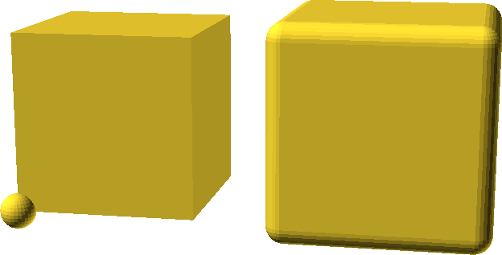
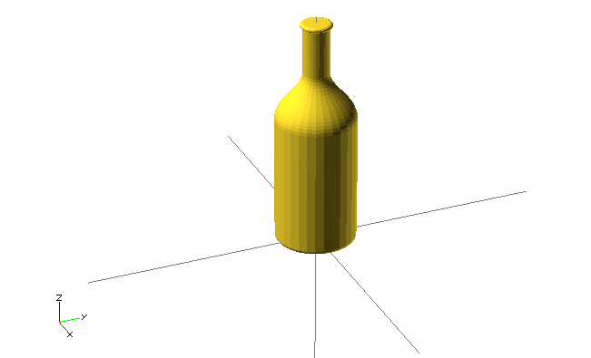

OpenSCAD
========

Nezbytný úvod
-------------

-   [CSG modelování](http://cs.wikipedia.org/wiki/Constructive_solid_geometry)
    -   **základní primitiva** - koule, kužel/válec, kvádr...
    -   **transformace** - posun, škálování, rotace...
    -   **booleovské operace** - rozdíl, průnik, sloučení
    -   **strom** - tyto věci jsou reprezentovány ve stromu

-   [manuál v angličtině](http://en.wikibooks.org/wiki/OpenSCAD_User_Manual) 
    -- velmi vyčerpávající, použijte jako referenci

CSG strom
---------


([pic by Zottie](http://commons.wikimedia.org/wiki/File:Csg_tree.png))

User interface
--------------

-   myší v oblasti s renderem
-   **F5** - rychlý náhled (nepřesný)
-   **F6** - plnohodnotný render -- poté export do STL
-   Automatic reload and compile
-   možnosti zobrazení (**F9**, **F12**, osy)

Syntax
------

-   **podobné C/C++** -- středníky, chlupaté závorky, komentáře
    -   **čísla** buď celá nebo desetinná -- `1`, `0`, `-5`, 
        `5.3`, `9.99998`, `8/5`
    -   čísla nemají jednotky, předpokládáme milimetry
    -   **vektory/body** v hranatých závorkách -- `[1,2,3]`

-   **stringy** v dvojitých uvozovkách -- `echo("Ahoj světe!");`

-   **proměnné** nejsou úplně proměnné, ale spíše **konstatnty**
    -   `a = 3; echo(a); a= 5;` -- `ECHO: 5`

-   **matematické [výrazy](http://en.wikibooks.org/wiki/OpenSCAD_User_Manual/Mathematical_Operators) a [funkce](http://en.wikibooks.org/wiki/OpenSCAD_User_Manual/Mathematical_Functions)**, PI

-   nejedná se o programovací ale deskriptivní jazyk!

-   přehledný cheat sheet <http://www.openscad.org/cheatsheet/>

Primitiva
---------

-   `cube(size,center);` -- kvádr (`size=[1,2,3]`) nebo krychle (`size=5`)
-   `sphere(``r);` -- koule
-   `cylinder(h,r1,r2,center);` -- (komolý) kužel (`r1,r2`) 
    nebo válec (`r`)
-   `polyhedron(...);` -- mnohostěn, nešahat
-   parametry vhodné pojmenovávat, např `cylinder(r=5,h=2)`

Příklad: Primitiva
------------------

```cpp
  cube(150,center=true);
  sphere(100);
```


Transformace
------------

-   `scale()` vs. `resize()` -- poměr, absolutní hdonota
-   `rotate([deg,deg,deg])` nebo `rotate(deg,[1,1,0])`
-   `translate([x,y,z])` -- posun
-   `mirror([1,0,0])` -- zracadlení
-   `multmatrix(...) `-- transformační matice, nešahat
-   `color()` -- na 3D tisk nefunguje
-   vše kolem počátku

Příklad: Transformace
---------------------

```cpp
  color("green") rotate([0,0,60]) translate([30,0,0]) cube(5);
  color("red") translate([30,0,0]) rotate([0,0,60]) cube(5);
```


CSG modelování
--------------

-   `union()` -- sloučení: provádí se implicitně na celek
-   `difference()` -- rozdíl: od prvního objektu odečte všechny další
-   `intersection()` -- průnik: průnik všech objektů

Příklad: Sjednocení
-------------------

```cpp
  union() {
    cube(150,center=true);
    sphere(100);
  }
```


Příklad: Rozdíl
---------------

```cpp
  difference() {
    cube(150,center=true);
    sphere(100);
  }
```


Příklad: Průnik
---------------

```cpp
  intersection() {
    cube(150,center=true);
    sphere(100);
  }
```


Cykly a podmínky
----------------

-   `for (z = [-1, 1])` -- pro z v hodnotách -1 a 1
-   `for (i = [0 : 5])` -- pro i od 0 do 5
-   `for (i = [0 : 0.2 : 5])` -- pro i od 0 do 5, použij krok 0.2
-   `for (xpos=[0:3], ypos = [2,4,6]) `-- vnořený cyklus jedním zápisem

-   implicitní `union()` na výsledku
    -   proto existuje `intersection_for()` -- funguje stejně, 
        jen s `intersection()`

-   podobně `if (a > b)` nebo třeba `if (center == true)`

Příklad: Cyklus s průnikem
--------------------------

```cpp
  intersection_for(n = [1 : 6]) {
    rotate([0,0,n*60]) translate([5,0,0]) sphere(12);
  }
```


Moduly
------

-   `module foo(bar)` -- jako funkce nebo metoda

-   "vrací" 3D objekt

-   přijímá parametry, můžou nabývat výchozích hodnot

-   může přijímat `child()`

-   můžete je mít v jiných souborech a použít `include `<f.scad>`;` nebo 
    `use `<f.scad>`;`
    -   `use` umožňuje použít moduly,  \* `include` rovnou vykreslí, 
        co se v souboru vykreslí

Příklad: Modul
--------------

```cpp
  module roundcube(size=1,center=false,corner=1) {
    minkowski() {
      cube(size,center);
      sphere(corner);
    }
  }
  roundcube([50,80,80],corner=5);
```


child()
-------

-   `child(0)` .. `child($children-1)`

-   `children()`

Příklad: child()
----------------

```cpp
  module elongate() {
    for (i = [0 : $children-1])
      scale([10 , 1, 1 ]) child(i);
  }
  elongate() {sphere(30); cube(45,center=true); cylinder(r=10,h=50);}
```


Debugging
---------

-   `%` - F5 vykreslí poloprůhledně, F6 nevykreslí

-   `#` - F5 vykreslí poloprůhledně, F6 normálně

Příklad modifikátoru
--------------------

```cpp
  difference() {
    sphere(50,$fn=5);
    #cube(65,center=true);
  }
```


Pomocníčci
----------

-   `minkowski()` "objede" první objekt druhým, pak případně třetím...

-   `hull()` "opláští" objekty co nejmenším pláštěm

-   obojí může být poměrně pomalé

Příklad: minkowski() a hull()
-------

```cpp
  minkowski() {
    hull() {
      rotate([120,0,0]) cylinder(h=1,r=10);
      translate([0,30,0]) rotate([-120,0,0]) cylinder(h=1,r=13);
      translate([0,15,25]) cylinder(h=1,r=8);
    }
    sphere(3);
  }
```



Dvourozměrný subsystém
----------------------

-   je možné vyvářet 2D primitivy
    -   `circle()`, `square()`, `polygon()`
    -   poté `linear_extrude()` nebo `rotate_extrude()`

-   `projection()` slouží k projekci 3D objektů do 2D

-   více info [v manuálu](http://en.wikibooks.org/wiki/OpenSCAD_User_Manual/Using_the_2D_Subsystem)

-   2D objekty se tváří jako malé úzké 3D objekty, ale nejdou tak vyrendrovat

2D primitiva
------------

-   `square()` jako alternativa `cube()`
-   `circle()` jako alternativa `sphere()`
-   `polygon()` jako alternativa `polyhedron()`

offset()
--------

-   `offset()`
-   `r` pro zaoblené rohy
-   `delta` pro špičaté rohy
-   `chamfer` (bool, jen s `delta`) "uřízne" rohy

linear_extrude()
----------------

-   vytáhne 2D tvar do prostoru
-   `height` -- výška vytažení
-   `center` -- false jede jen nahoru, true na oba směry
-   `twist` -- o kolik stupňů se 2D tvar otočí na `height`
-   `slices` -- počet kroků u `twist`

Příklad: linear_extrude()
-------------------------

```cpp
  linear_extrude(height=20,twist=180,slices=100,center=true) {
    square(5);
    square(5,true);
  }
```


rotate_extrude()
----------------

-   rotuje 2D tvar do prostoru
-   kolem osy Y, potom "vzpřímení" na Z
-   záleží na pozici
-   nezáleží na rotaci

Příklad: rotate_extrude()
-------------------------

```cpp
  rotate_extrude($fn=200) polygon(points=[[0,0],[2,1],[1,2],[1,3],[3,4],[0,5]]);
```


2D import
---------

-   můžete importovat DXF soubory
-   lze [převést z SVG na DXF](http://en.wikibooks.org/wiki/OpenSCAD_User_Manual/Other_2D_formats#SVG)
    -   zmrší to velikost, je třeba použít resize()

Příklad: import() na 2D
-----------------------

```cpp
  rotate_extrude() resize([20,0],[true,true]) import("bottle.dxf");
```



projection()
------------

-   promítne 3D objekt na rovinu XY
-   `cut` -- true zobrazí jen průnik s rovinou XY
-   výsledkem je 2D tvar

Příklad: projection()
---------------------

```cpp
  use </usr/share/openscad/examples/example002.scad>
  linear_extrude(20) projection() rotate([90,0,0]) example002();
```


import()
--------

-   kromě DXF lze importovat i STL soubory

-   ne vždy se povedou vyrendrovat
    -   je třeba je opravit
    -   viz [oprava meshe](mesh.md)

Příklad: import() na 3D
-----------------------

```cpp
  difference() {
    import("kangaroo5.stl");
    // http://www.thingiverse.com/thing:33273 CC BY-NC-SA
    translate([0,-10,80]) cube(30,true);
  }
```


surface()
---------

-   `surface(file = "smiley.png", center = true);`


*obrázek [pochází] z OpenSCAD manuálu, autorem je Torsten Paul*

[pochází]: https://commons.wikimedia.org/wiki/File:OpenSCAD_surface_example.png

Rozlišení
---------

-   `$fn`, `$fa` a `$fs` nastavuje rozlišení, viz 
    [manuál](http://en.wikibooks.org/wiki/OpenSCAD_User_Manual/The_OpenSCAD_Language#.24fa.2C_.24fs_and_.24fn)
    -   může se nastavit globálnbě
    -   nebo uvnitř chlupatých závorek
    -   může se předat jako parametr čemukoli -- modulu nebo primitivě

Simple - 2-Manifold
-------------------

-   pro export STL je potřeba aby byl model 2-Manifold
-   skoro vše řeší výsledný `union()`
-   problém: společná hrana -- nereálné
-   jinak lze zanést chybu polyhedronem

Příklad: nemanifoldní model
---------------------------

```cpp
    cube(20); translate([20,20,0]) cube(20);
    // i=0.0001; cube(20); translate([20-i,20-i,0]) cube(20);
```


Knihovna MCAD
-------------

-   spousta elementárních i pokročilých věcí
-   nové jakože primitivy
-   vhodné věci pro RepRap
    -   motorky
    -   řemeničky

-   je třeba `include`, ne `use`!
-   [info](https://github.com/elmom/MCAD/blob/master/README.markdown)

Příklad: MCAD
-------------

```cpp
  include `<MCAD/stepper.scad>`
  motor(Nema17);
```


