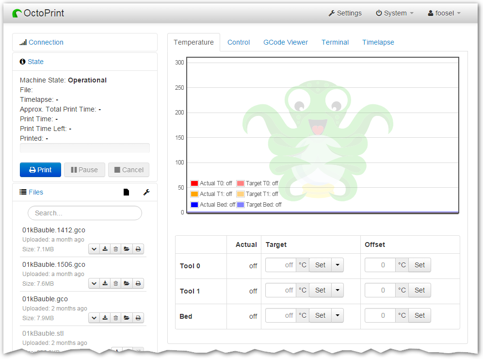

Tisk
====

OctoPrint
---------

Při kalibračním a dalším tisku budeme používat webový 
ovládací interface [OctoPrint](http://octoprint.org).

Předletová příprava
-------------------

Před spuštěním tisku je potřeba dodržet několik kroků. V případě tiskárnu 
nezkontrolujeme, můžeme skončit s špatným výtiskem, nebo v horším 
případě s poškozenou tiskárnou. 

1.  Zkontrolovat správné nastavení osy Z (výška endstopu)
2.  Připravit tiskovou desku (bude upřesněno)
3.  Předehřát tiskovou desku (trvá déle než předehřátí trysky)

Nastavení pro Slic3r
--------------------

Config bundle ke stažení [zde](../configs/printing/Slic3r_config_bundle.ini)

Testovací objekt
-----------------

[20mm-box.stl](../stls/printing/20mm-box.stl)
