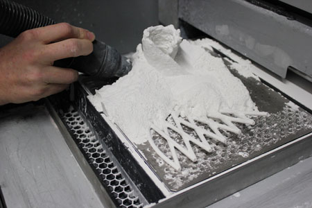

Technologie tisku a RepRap
==========================

Proč 3D tisk?
-------------

-   levná a rychlá výroba prototypů (v řádu hodin)
-   snadné přenesení grafických návrhů do fyzické podoby
-   nejsme dostatečně zruční abychom si to vyrobili sami
-   nechceme sériovou výrobu
-   zábava 😎

Základní princip
----------------

Jak to celé funguje?

Všechny technologie 3D tisku mají společný základní princip kladení vrstev na 
sebe, kterému se říká aditivní výroba. Je to opačný proces k obrábění materiálu.
Místo toho, aby byl objekt z kusu materiálu vyřezán, je z materiálu 
postupně vyráběn.

3D model je "rozřezán" na tenké vrstvy, které se pak v tiskárně kladou na sebe. 
M콢쬰me si to představit, jako kdybychom chtěli za pomocí stolní tiskárny vyrobit
3D objekt z papíru. Nejprve vytiskneme všechny potřebné vrstvy, poté n콢쬶ami 
vystříháme a nalepujeme na sebe.

Stereolitografie (SLA)
----------------------

Metoda vytváření objektů z tekutého polymeru, který je postupně vytvrzován 
pomocí záření různých vlnových délek. 
[Video](https://www.youtube.com/watch?v=NM55ct5KwiI)


(Obrázek z [Wikipedie](https://commons.wikimedia.org/wiki/File:Stereolithography_apparatus.jpg) © Materialgeeza (CC BY-SA).)

Práškový tisk (SLS, DMLS)
------------------------

Technologie je zalo쬰na na kladení tenkých vrstev prášku a následného vytvrzení 
pouze potřebných míst. Vytvrzení m콢쬰 probíhat bu캞 zapečením prášku laserem 
(například kov, DMLS), nebo pou쬴tím tekutého polymeru a ozářením většinou 
UV zářením. [Video SLS](https://www.youtube.com/watch?v=9E5MfBAV_tA), 
[Video DMLS](https://www.youtube.com/watch?v=bgQvqVq-SQU)



([Obrázek](https://www.prlog.org/12539309-3d-printing-powder-market-analysis-till-2021-download.html) © PRLog.)

PolyJet
-------

Podobně jako v inkoustových tiskárnách je polymer vytryskáván z tiskové hlavy 
pomocí miniaturních trysek. Následně je vrstva vytvrzena UV paprskem.
[Video](https://www.youtube.com/watch?v=ZjXh1RJfA34)


(Nedok치쬰me dohledat původ obrázku, pom콢쬰te nám? Na internetu je příliš roz코칤콏ený.)

FFF/FDM/Thermoplastic extrusion
-------------------------------

FFF (fused filament fabrication) nebo FDM (Fused Deposition Modeling) je 
technologie, která je zalo쬰na na principu "tavné pistole". Plast je tlačen do 
trysky, kde je roztaven a následně je kladen na podlo쬶u.
[Video](https://www.youtube.com/watch?v=WHO6G67GJbM)


(Obrázek z [Wikipedie](https://commons.wikimedia.org/wiki/File:FDM_by_Zureks.png) © Zureks (CC BY-SA).)

*1 - tryska vytlačující plast, 2 - vymodelovaná část objektu, 
3 - pohybující se platforma*

RepRap
------

-   Adrian Bowyer, University of Bath 2006
-   RepRap Darwin, 2007
-   RepRap Mendel, 2009
-   3DPrintLab, 2012

Více na [reprap.org/wiki/RepRap_history](http://reprap.org/wiki/RepRap_history).

Technologie RepRap
------------------

FFF/FDM - technologie tavení plastového drátu (termoplastu) v trysce. 
Principem RepRap tiskárny je částečná replikace sebe sama.

### Výhody

-   Levné (Pořizovací náklady cca 10000 Kč, cena plastu cca 0.7 Kč/g)
-   OpenSource/OpenHardware

### Nevýhody

-   Pořízení první tiskárny (slepice/vejce)

Základní modely RepRap
----------------------


(© [Adrian Bowyer](http://reprap.org/wiki/File:RepRapOneDarwin-darwin.jpg), GNU FDL)


(© [Adrian Bowyer](http://reprap.org/wiki/File:Mendel.jpg), GNU FDL)


(© [Johann C. Rocholl](http://reprap.org/wiki/File:Rostock.jpg), GNU FDL)


Fork-modely
-----------


(© [Petr Krčmář, root.cz](https://www.root.cz/galerie/linuxalt-2012/#29), pou쬴to se svolením)


(© [Josef Průša](http://reprap.org/wiki/File:Assembled-prusa-mendel.jpg), GNU FDL)


(© [Bitflusher](http://reprap.org/wiki/File:Prusai3-metalframe.jpg), GNU FDL)


(© [Petr Zahradník](https://www.clexpert.cz/3dtisk/rebel2/), fair use)


(vlastní foto)


(© [Johann C. Rocholl](http://reprap.org/wiki/File:Kossel.jpg), GNU FDL)


Speciální typy
--------------


(© [Morgan 3D Printers](http://www.morgan3dp.com/reprap-morgan-source/), GPLv2)


(© [Emmanuel](https://www.thingiverse.com/thing:15877), GPLv2)


Vstupní formát (Slicing)
------------------------

**STL** (STereoLitography) -- mesh trojúhelníků, popisuje povrchovou geometrii 
modelu.

Exportovaný z jakéhokoliv 3D modelovacího programu. Více informací v
kapitole [Práce s meshí](mesh.md).

Vstupní formát tiskárny
-----------------------

**GCode** -- instrukce pro tiskárnu 

Příklad:

```plain
G1 X10 Y10 Z10 E10
M220 S150 
```

Tiskové materiály
-----------------

### SLA

Fotopolymer - pro domácí pou쬴tí příliš drahý

### SLS

Práškový materiál (kov nebo plast)

### FDM/FFF

Plastový materiál v drátu

-   ABS - lego a tiskárny
-   PLA - ekologický
-   Nylon - vysoce odolný
-   PVA - rozpustný ve vodě
-   [FilaFlex](https://www.youtube.com/watch?v=Vmb9iwFpaOs) - elastický
