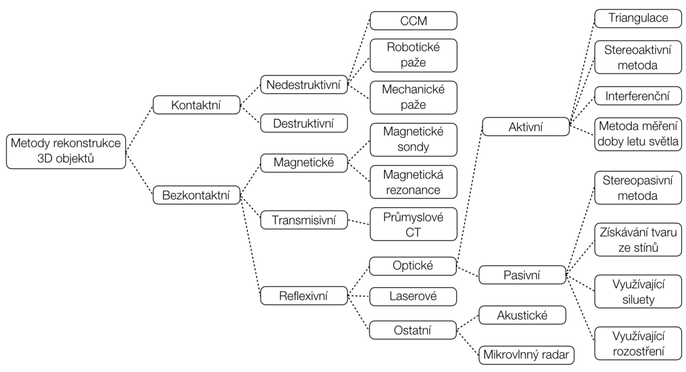
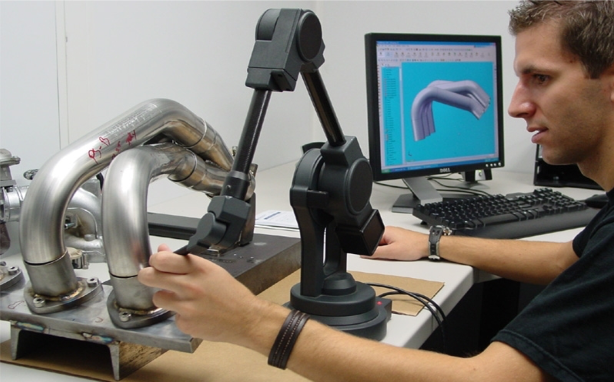

# Skenování

3D skenování je proces digitalizace fyzického objektu do počítačového 3D modelu. 

## Motivace

3D skenování již dávno není novou technologií. Využívání 3D skenování zasahuje do čím dál širšího okruhu odvětví jako např. architektura, archeologie, filmové efekty, počítačové hry, strojírenství, lékařství. Ve spojení s 3D skenerem dávají tyto technologie nečekané možnosti využití jako jsou například různé čelistní, pánevní nebo nebo lebeční náhrady přímo na míru pacienta. Je možné také archivovat ohrožené památky pro budoucí generace, nebo naopak pomocí 3D skenování je možné rekonstruovat různá historická obydlí podle vykopávek. Nedílnou součástí jsou 3Dskenery v oblasti geodetického měření, digitalizace budov, kontrole kvality nebo zabezpečovacích systémů.

## Rozdělení 3D skenerů

Rozdělení 3D skenerů je možné mnohými způsoby. Vybrané rozdělení bere jako hlavní kritérium dotykové a bezdotykové metody skenování. Nejpoužívanější skenery jsou ve větvi reflexivních. Laserové metody mohou spadat i do metod aktivních optických využívající triangulaci nebo metodu měření doby letu. V taxonomii na Obr.1 jsou laserové metody vyčleněny zvlášť.

TODO: Prekreslit schema

(Obrázek [JAN ČERMÁK](https://www.vutbr.cz/www_base/zav_prace_soubor_verejne.php?file_id=103850).)

### Kontaktní
Dochází ke kontaktu skeneru a skenováhé modelu.

#### Destruktivní
Tento typ skenerů je poněkud atypický, protože jde v podstatě o frézku s kamerou. Na začátku je potřeba měřený objekt zalít do bloku tak, aby pomocný materiál dokonale zatekl do všech dutin. Barva tohoto materiálu musí být kontrastní oproti barvě skenovaného objektu. Takto nachystaný díl se upne na desku frézky a postupně se odfrézovávají tenké vrstvičky konstantní tloušťky. Každá nově odkrytá vrstva je vždy vyfocena a snímek uložen pro pozdější zpracování. Výsledkem je tedy sada 2D fotek s uloženou informací, v jaké výšce Z byla fotka pořízena. Software na každé fotce na přechodu barev zalitého objektu a pomocného materiálu vyextrahuje okrajovou křivku. Tato křivka je reprezentována jako body v rovině. Pokud se spojí křivky ze všech odfrézovaných hladin, pak dostaneme 3D mrak bodů.

#### Nedestruktivní
Nedestruktivní kontaktní skenery zahrnují všechny narozdíl od destruktivních metod objekt není při digitalizaci nijak poškozen. Kontaktní 3D skenery zkoumají povrch objektu pomocí fyzického hmotného dotyku. Zatímco objekt zůstává v klidu připevněný k podložce, polohovací rameno, na kterém je upevněna bodová nebo kuličková sonda umožňuje uživateli bodově snímat 3D data z fyzického objektu.

(Obrázek [Micro Scribe](http://charlesschimp.blogspot.cz/2011/02/roland-microscribe.html).)

### Bezkontaktní

#### Magnetické skenery
Můžeme je rozdělit na skenery s magentickou sondou nebo skenery využívající magnetickou rezonanci. Použitím druhého zmíněného typu zařízení můžeme získávat informace o vnitřní geometrii součástí. Jedná se o nedestruktivní skenery pracující na stejném principu jako klasické magnetické rezonance požívané ve zdravotnictví. Zařízení jsou většinou mobilní a používají se např. ke kontrole potrubí, kotlů nebo jiných uzavřených nádob.

#### Transmisivní skenery
Zástupcem transmisivních skenerů jsou skenery využívající technologii počítačové tomografie (CT). Stejně jako u skenerů využívajících magnetickou rezonanci je možné tímto typem skeneru získávat údaje o vnitřní stavbě zkoumaného objektu. Pro přenos informace se využívá rentgenové záření. Narozdíl od zdravotnických verzí CT se při tomto použití používá vyšší intenzita záření. Tyto zařízení jsou stále poměrně vzácné, to dokazuje i fakt, že se v České republice vyskytuje pouze jeden exemplář.

#### Reflexivní skenery
Do této kategorie spadají skenery akustické (např. sonar), laserové, ale především optické. Optické skenery jsou nejrozšířenější a nejpoužívanější větev 3D skenerů. Z toho vyplývá i největší množství ruzných technologických řešení a tím i dalšího dělení.

### Optické - aktivní 3D skenery

Aktivní optické metody se dále dělí podle toho, jaká fyzikálncí vlastnost daného záření se použije pro výpočet prostorové souřadnice bodu

#### Time of flight
Nejjednodušší metoda se nazývá „time of flight“. Tato metoda je založená na měření času, za jakou dobu se vyslaný paprsek vrátí zpět na snímač po odrazu od objektu.

#### Triangulace
Další možností je metoda „triangulation“, která na základě známého úhlu mezi projektorem a snímačem, známé vzdálenosti projektoru od snímače a známé polohy měřeného bodu na snímači, dokažé dopočítat skutečný prostorový bod na povrchu objektu.

Triangulace může být:

  - Aktivní 
  - Pasivní

#### Structured light
Další aktivní optickou metodou je „structured light“. Ta používá projekci pravidelného vzoru na objekt a na základě deformace tohoto vzoru pak počítá prostorové souřadnice bodů. Výhodou této metody je obrovská rychlost, s jakou se nasnímá daný povrch objektu. Řádově jde o miliony bodů za několik sekund.

V praxi je možné se s touto technologií setkat například u

  - Microsoft Kinect
  - Assus Xtion
  - Intel RealSense

  - Predevsim Time of flight
      - Pouzivane v prumyslu     
  - Stereo aktivni a pasivni
      - Aktivni napriklad horus 
  - Structured light
      - Kinect
      - Realsense

## CloudCompare
Jedná se opensource program pro editaci a úpravu mračna bodů a 3D modelů. Zároveň program umožňuje počítat zajímavé údaje o podobnostech nebo měřit různé vzdálenosti a statisky.

Více info o programu [zde](http://www.cloudcompare.org)

### Ukázka v programu
> Tato ukázka proběhně živě na cvičení
 

  - Základní popis programu
  - Ukázka 1 (Model nohy)
      - Potřebné modely jsou [Sken](../stls/scan/foot_scan.bin) a [Reference](../stls/scan/foot_reference.stl) 
      - Nahrání mračna bodů
      - Ukázka rekonstrukce 3D modelu
      - Ukázka shaderu
  - Ukázka 2 (Model zahrady)
      - Potřebné modely jsou [Sken 1](../stls/scan/garden1.bin) a [Sken 2](../stls/scan/garden2.bin)
      - Importovat 2 point cloudy se zahradou
      - Ukázka automatické registrace
      - Ukázka poočítaní vzdáleností
  - Ukázka 3 (Model zahrady + segmentace)
      - Potřebné modely jsou [Sken 1](../stls/scan/garden1.bin) a [Sken 2](../stls/scan/garden2.bin)
      - Ukázka segmentace
      - Ukázka ručního výběru bodů pro registraci
      - Připomenutí si měření vzdáleností

### Užitečné odkazy
Návod na rekonstrukci modelu pomocí MeshLabu nebo CloudComparu:  [Horus_Guide_to_post-processing_of_the_point_cloud.pdf](https://storage.googleapis.com/bqcom15.statics.bq.com/prod/resources/manual/Horus_Guide_to_post-processing_of_the_point_cloud-1475833823.pdf)
