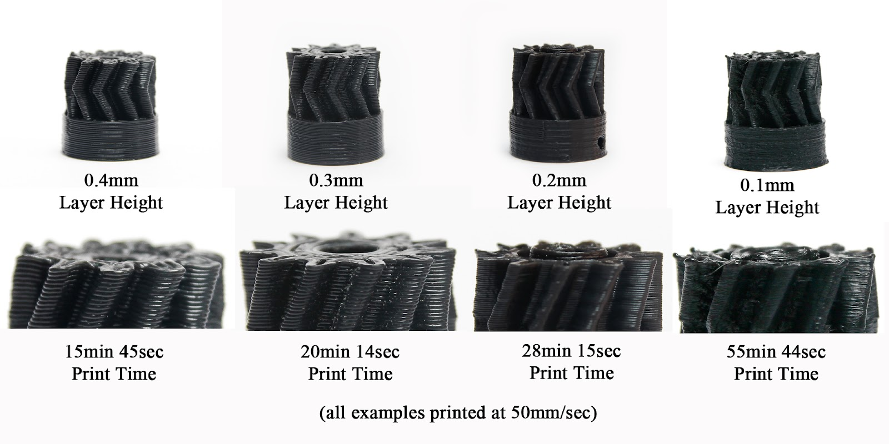
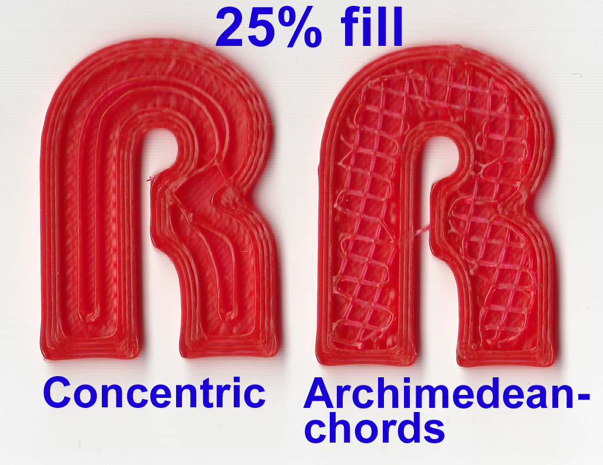

Slic3r
======

Program Slic3r
--------------

-   OpenSource nástroj pro generování GCode
-   Více na [Webu projektu](http://slic3r.org)

Ukázka
------

Další fotografie z článku jsou © Richard Horne, z článků odkázaných na konci
stránky.

Panely
------

-   Plater - Na rozložení objektů po tiskové ploše
-   Print Settings - Veškerá nastavení tisku, jako rychlost, 
    výplň, podpory, atd.
-   Filament Settings - Nastavení specifické pro materiál. 
    Teploty, průměr, chlazení.
-   Printer Settings - Nastavení specifické pro tiskárnu. Průměr trysky, 
    velikost tiskové plochy, atd.

Pozn.: Jelikož jsme experti, tak budeme pracovat v Expert režimu.
Režim se přepíná v *File | Preferences*.

Printer Settings
----------------

-   General
    -   Nastavení rozměrů tiskárny
    -   Typ firmwaru
    -   Počet extruderů

-   Custom G-code
    -   Vlastní definice startu a konce souboru

-   Extruder X
    -   Průměr trysky
    -   Offset, pokud máme více trysek vedle sebe
    -   Rectraction
        -   Eliminace tlaku v trysce

Filament Settings
-----------------

-   Filament
    -   Průměr materiálu
    -   Teploty

-   Cooling
    -   Chlazení objektů, aby se nepřehřívaly/nedeformovaly

Print Settings
--------------

### Layers and Perimeters

#### Výška vrstvy

Ideální výška je okolo 0,2mm

#### Perimeters

Jak silný bude "plášť" objektu

### Infill

Více o výplni na stránce [programu](http://manual.slic3r.org/expert-mode/infill)

### Speed

Možnost nastavit rychlosti konkrétních částí objektu.

### Skirt

Obvodová linie objektu.

Lze nastavit počet linií a výšku.
Proč asi výšku?

### Support Material

Proč?

Více na stránce [programu](http://manual.slic3r.org/expert-mode/support-material)

Plater
------

-   Poskládání objektů na tiskovou plochu

Načítání konfigurace
--------------------

Pro práci na našich tiskárnách budeme vždy používat naše nastavení, které
najdete v souboru [slic3r_config_bundle.ini](../configs/printing/slic3r_config_bundle.ini).

Pro načtení konfigurace z našeho souboru je třeba použít volbu *Load Config Bundle...*
z nabídky *File*. **Pozor!** Obyčejná varinta *Load Config...* funguje jinak
a při jejím použití nedojte ihned k chybě programu, ale data se nenačtou celá.

Po načtení config bundlu vám aplikace oznámí, že načetla 3 presety. Pokud to
neudělá, udělali jste chybu (použili jste *Load Config...* místo
*Load Config Bundle...*).

Odkazy
------

-   starší ale zajímavý třídílný článek **slic3r is nicer** [1](http://richrap.blogspot.cz/2012/01/slic3r-is-nicer-part-1-settings-and.html), [2](http://richrap.blogspot.cz/2012/01/slic3r-is-nicer-part-2-filament-and.html), [3](http://richrap.blogspot.cz/2012/01/slic3r-is-nicer-part-3-how-low-can-you.html), 
