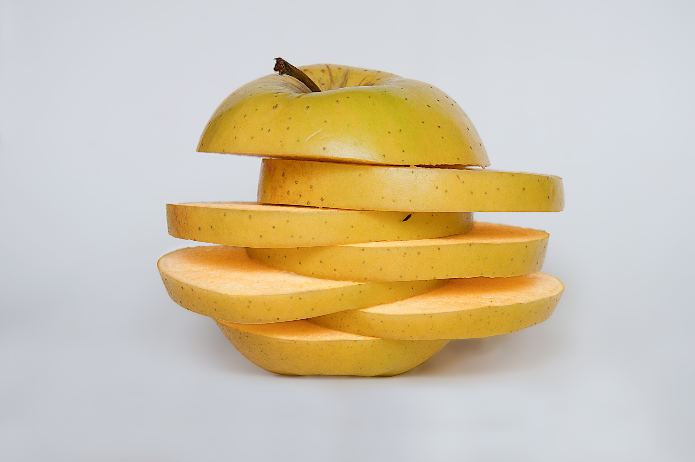

Slicing
=======

Proč slicing?
-------------

Rasterizace
-----------

"Při zobrazení reálného modelu ve světových souřadnicích na výstupní zařízení 
(rastrové, vektorové) potřebujeme zajistit co nejvěrnější podobnost reálného 
a zobrazovaného modelu."

Rasterizace 3D modelu
---------------------

Přenos 3D modelu do reálného světa
----------------------------------

-   Snažíme se najít hranici při které je ještě snesitelná doba tisku a 
    objekt vypadá „dobře“

Ideální parametry
-----------------

-   Tloušťka stěny
-   Výška vrstvy
-   Množství výplně

Úkoly
-----

