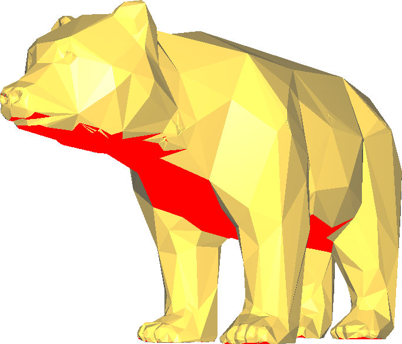
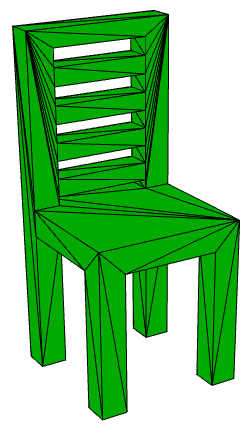

# Podpory

Jelikož se blíží Vánoce (hehe) a vy byste potřebovali nějakou vánoční výzdobu,
rozhodli jste se vytisknout si model vánočního [medvěda](../stls/supports/bear.stl).
Tento model je bohužel tak nešťastně řešený, že je nutné ho vytisknout s podporami.
Využijte nastavení Slic3ru, které umožňuje takové podpory generovat.

Aby si mohl roznašeč dárků při skládání pod stromeček odpočinout,
musíme mu ještě vytisknout malou [židličku](../stls/supports/bear.stl).
Židlička je opět poměrně nešťastná. A to tak, že má malé nožičky.
Proto zajistěte to, aby se dostatečně přichytla k tiskové ploše
(vzpomeňte si, co jsme si říkali o různých podložkách objektů jako Raft a Brim).

Stáhněte si opět [config](../configs/printing/slic3r_config_bundle.ini) pro Slic3r.
