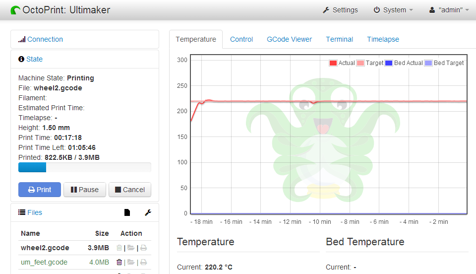

Tisk
====

OctoPrint
---------

Při kalibračním a dalším tisku budeme používat webový 
ovládací interface [OctoPrint](http://octoprint.org).

Předletová příprava
-------------------

Před spuštěním tisku je potřeba dodržet několik kroků. V případě tiskárnu 
nezkontrolujeme, můžeme skončit s špatným výtiskem, nebo v horším 
případě s poškozenou tiskárnou. 

1.  Zkontrolovat správné nastavení osy Z (výška endstopu)
1.  Připravit tiskovou desku (bude upřesněno)
1.  Předehřát tiskovou desku (trvá déle než předehřátí trysky)

Nastavení pro Slic3r
--------------------

Config bundle ke stažení [zde](../images/tisk/slic3r_config_bundle.ini.zip)

Testovací objekty
-----------------

[20mm-box.stl.zip](../images/tisk/20mm-box.stl.zip)

Trysky
------

### 3Draty

### JHead

Úkoly
-----

