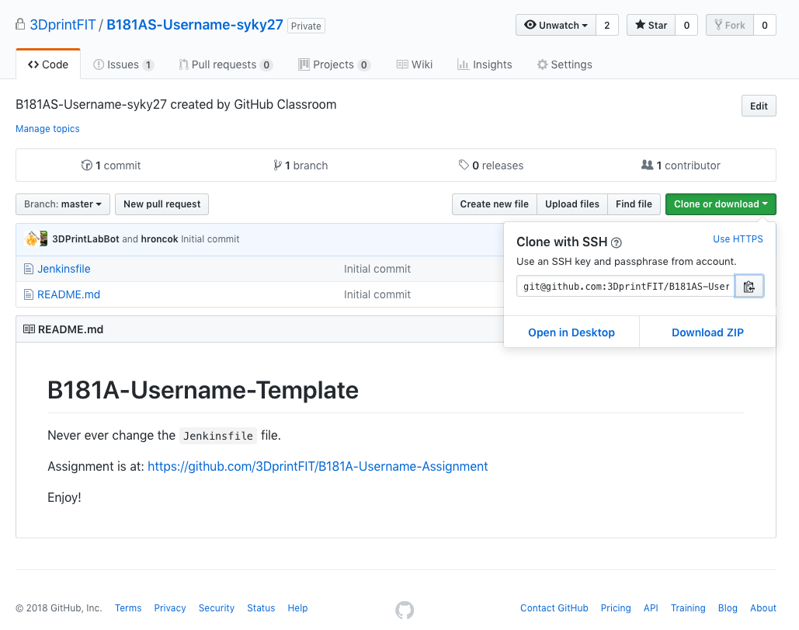
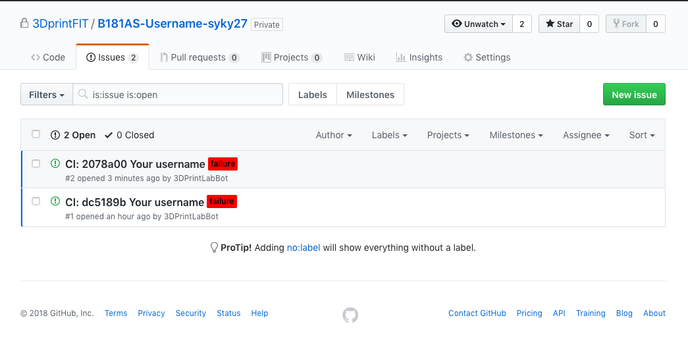

Git Tutorial
------------

Odevzdávání veškeré práce, která je ve virtuální podobě během BI-3DT, 
probíhá pomocí gitu. Git server který se používá je GitHub.
Tento tutorial je pouze rychlý úvod jak s gitem pracovat pro potřeby předmětu, 
rozhodně toto není vše co by jste měli znát. Ale to co je tu dočtete Vám bude stačit
k tomu aby jste odevzdali vše co budete potřebovat.

Počáteční stav
~~~~~~~~~~~~~~

Na každém cvičení budete mit připraveny link, který Vám vygeneruje nový repozitář 
na GitHubu. Pokud nemáte GitHub účet tak Vás server vyzve k jeho vytvoření 
po navštívení linku generujicí repozitář. Repozitáře se generují pod organizací 
https://github.com/3DprintFIT[3DprintFIT] a jsou privátní, to znamená že do nich
máte přístup pouze vy a my jako učitelé.

Po automatickém vytvoření nového repozitáře uvidíte toto:

image:../images/git/new_repo.jpg[New Repo]

Instalace gitu
~~~~~~~~~~~~~~~

[source,console]
----
[syky@virtu-fedora ~]$ git
bash: git: command not found
----

https://git-scm.com/download/linux[Linux]
https://git-scm.com/download/mac[macOS]
https://git-scm.com/download/win[Windows]

Po instalaci:

[source,console]
----
[syky@virtu-fedora ~]$ git
usage: git [--version] [--help] [-C <path>] [-c <name>=<value>]
           [--exec-path[=<path>]] [--html-path] [--man-path] [--info-path]
           [-p | --paginate | --no-pager] [--no-replace-objects] [--bare]
           [--git-dir=<path>] [--work-tree=<path>] [--namespace=<name>]
           <command> [<args>]

These are common Git commands used in various situations:

start a working area (see also: git help tutorial)
   clone      Clone a repository into a new directory
   init       Create an empty Git repository or reinitialize an existing one

work on the current change (see also: git help everyday)
   add        Add file contents to the index
   mv         Move or rename a file, a directory, or a symlink
   reset      Reset current HEAD to the specified state
   rm         Remove files from the working tree and from the index

examine the history and state (see also: git help revisions)
   bisect     Use binary search to find the commit that introduced a bug
   grep       Print lines matching a pattern
   log        Show commit logs
   show       Show various types of objects
   status     Show the working tree status

grow, mark and tweak your common history
   branch     List, create, or delete branches
   checkout   Switch branches or restore working tree files
   commit     Record changes to the repository
   diff       Show changes between commits, commit and working tree, etc
   merge      Join two or more development histories together
   rebase     Reapply commits on top of another base tip
   tag        Create, list, delete or verify a tag object signed with GPG

collaborate (see also: git help workflows)
   fetch      Download objects and refs from another repository
   pull       Fetch from and integrate with another repository or a local branch
   push       Update remote refs along with associated objects

'git help -a' and 'git help -g' list available subcommands and some
concept guides. See 'git help <command>' or 'git help <concept>'
to read about a specific subcommand or concept.
----

Nastavení SSH klíče
~~~~~~~~~~~~~~~~~~~

Aby jste mohli komunikovat s git serverem, je potřeba zajistit vaši identifikaci,
k tomu slouží SSH klíč.

Nemáte řádný vlastní SSH klíč
^^^^^^^^^^^^^^^^^^^^^^^^^^^^^

Vytvořte ho pomocí:

[source,console]
----
[syky@virtu-fedora ~]$ ssh-keygen
----

Budete dotazani na umistění public/private páru klíče a na passphrase, je zcela
na Vás co zvolíte, defaultni cesta ke klíči je `~/.ssh/` a passphrase může být 
i prázdný string.

Výsledek by měl vypadat nejak takto:

[source,console]
----
Generating public/private rsa key pair.
Enter file in which to save the key (/home/syky/.ssh/id_rsa):
Created directory '/home/syky/.ssh'.
Enter passphrase (empty for no passphrase):
Enter same passphrase again:
Your identification has been saved in /home/syky/.ssh/id_rsa.
Your public key has been saved in /home/syky/.ssh/id_rsa.pub.
The key fingerprint is:
SHA256:6hIZxGQ2Xmctitvr5D3U+XQv7+B6hZclhJMkLIGHG4U syky@virtu-fedora
The key's randomart image is:
+---[RSA 2048]----+
|   o= .==+...o   |
|   +ooEo+ o.+ .  |
|   ... = o   o   |
|    o o       . .|
|     =  S. .   oo|
|    + ... o . o.o|
|     .oo   o ..+ |
|    .+...   ..o..|
|     o+ ..  .o.+o|
+----[SHA256]-----+
----

Zobrazte si **PUBLIC** klíč (ten co končí `.pub`)
[source,console]
----
[syky@virtu-fedora ~]$ cat ~/.ssh/id_rsa.pub
----

Vysledek celý zkopírujte do scránky a předěte na https://github.com/settings/ssh/new[zadání klíče na GitHub]

[source,console]
----
ssh-rsa AAAAB3NzaC1yc2EAAAADAQABAAABAQCiFJ+V+CUF1u1ZRhphaLUU92auMtpJrjWxOMZF8Dqxc6E4cOfWsUNeCLjzeeOT7786DBLBVn60yjEPHcfRcl6hycOJkREpW1WOUTvzMU9nrBde0PTHoB2tV0acWpu+dgyvhMd82VZ6maCojnvvqv99HkQ4wb/HJHAWzTJvHslYXmOiukCxM7zdUaqGkCVvgx8HiCU32Fo3lYkf/7hLs2I8i/P6urNX9ui3vHpeTKXgFHt7vr2U33YcGzkitO8s6KGqWwom29vduXlIWRQMOCLRUTH8OlEm61A0Xful4Xtt1CKSlXDo9TOK6tfEPVI6kKUfCf+2py7glps+wAZ2dy0b syky@virtu-fedora
----

Klíč pastněte do do správného pole, Title pole je nepovinné a uložte.

image:../images/git/new_ssh_rsa.png[Add key to GitHub]

Uvididíte něco podobného:

image:../images/git/added_ssh_rsa.png[Added key to GitHub]

Práce s repozitářem
-------------------

Vytvořte si ideálně složku pro vaše Github repozitáře pro BI-3DT, a naclonujte si
repo, clonování znamená vytvoření lokání kopie, git je decentralizovaný verzovací
systém.

[source,console]
----
[syky@virtu-fedora ~]$ mkdir bi_3dt && cd "$_"
----

Naleznete **SSH URL**, (začíná `git@`) a naclonujte

[source,console]
----
[syky@virtu-fedora bi_3dt]$ git clone git@github.com:3DprintFIT/B181AS-Username-syky27.git
Cloning into 'B181AS-Username-syky27'...
The authenticity of host 'github.com (192.30.253.112)' can't be established.
RSA key fingerprint is SHA256:nThbg6kXUpJWGl7E1IGOCspRomTxdCARLviKw6E5SY8.
RSA key fingerprint is MD5:16:27:ac:a5:76:28:2d:36:63:1b:56:4d:eb:df:a6:48.
Are you sure you want to continue connecting (yes/no)? yes
Warning: Permanently added 'github.com,192.30.253.112' (RSA) to the list of known hosts.
remote: Enumerating objects: 4, done.
remote: Counting objects: 100% (4/4), done.
remote: Compressing objects: 100% (4/4), done.
remote: Total 4 (delta 0), reused 4 (delta 0), pack-reused 0
Receiving objects: 100% (4/4), done.
[syky@virtu-fedora bi_3dt]$
----

Vytvoří se Vám, složka s repozitářem viz

[source,console]
----
[syky@virtu-fedora bi_3dt]$ ll
total 0
drwxrwxr-x. 3 syky syky 54 Sep 28 13:05 B181AS-Username-syky27
----

Uvnitř naleznete veškeré soubory, které byli na serveru v době clonování

[source,console]
----
[syky@virtu-fedora B181AS-Username-syky27]$ ll
total 8
-rw-rw-r--. 1 syky syky 196 Sep 28 13:05 Jenkinsfile
-rw-rw-r--. 1 syky syky 152 Sep 28 13:05 README.md
----

Vytvořím, nový soubor:

[source,console]
----
[syky@virtu-fedora B181AS-Username-syky27]$ echo "My super secret username" > USERNAME
[syky@virtu-fedora B181AS-Username-syky27]$ ll
total 12
-rw-rw-r--. 1 syky syky 196 Sep 28 13:05 Jenkinsfile
-rw-rw-r--. 1 syky syky 152 Sep 28 13:05 README.md
-rw-rw-r--. 1 syky syky  25 Sep 28 13:10 USERNAME
----

Git mi umožňuje podivat se na změny u souboru virtu

[source,console]
----
[syky@virtu-fedora B181AS-Username-syky27]$ git status
On branch master
Your branch is up to date with 'origin/master'.

Untracked files:
  (use "git add <file>..." to include in what will be committed)

	USERNAME

nothing added to commit but untracked files present (use "git add" to track)
----

Vidím, že se vytvořil nový soubor `USERNAME`, přidám ho trackovaných souborů gitem

[source,console]
----
[syky@virtu-fedora B181AS-Username-syky27]$ git add USERNAME
[syky@virtu-fedora B181AS-Username-syky27]$ git status
On branch master
Your branch is up to date with 'origin/master'.

Changes to be committed:
  (use "git reset HEAD <file>..." to unstage)

	new file:   USERNAME
----

Popíši změnu pomoci commitu

[source,console]
----
[syky@virtu-fedora B181AS-Username-syky27]$ git commit -am"USERNAME file with my username"

*** Please tell me who you are.

Run

  git config --global user.email "you@example.com"
  git config --global user.name "Your Name"

to set your account's default identity.
Omit --global to set the identity only in this repository.

fatal: unable to auto-detect email address (got 'syky@virtu-fedora.(none)')
----

Pokud dostanu tento erro znamená to, že musím gitu řící kdo jsem čili:

[source,console]
----
git config --global user.email "someone@fit.cvut.cz"
git config --global user.name "Someone of Someone"
----

Poté zopakuji vytvoření commitu

[source,console]
----
[syky@virtu-fedora B181AS-Username-syky27]$ git commit -am"USERNAME file with my username"
[master 2078a00] USERNAME file with my username
 1 file changed, 1 insertion(+)
 create mode 100644 USERNAME
----

Commit vytvořen mohu se podivat co se změnilo

[source,console]
----
[syky@virtu-fedora B181AS-Username-syky27]$ git show
commit 2078a007fa2d91e7bc2bb40d802bfa4eb17fd05c (HEAD -> master)
Author: Someone of Someone <someone@fit.cvut.cz>
Date:   Fri Sep 28 13:21:39 2018 +0200

    USERNAME file with my username

diff --git a/USERNAME b/USERNAME
new file mode 100644
index 0000000..ac11935
--- /dev/null
+++ b/USERNAME
@@ -0,0 +1 @@
+My super secret username
----

Následně nahraji změny na GitHub

[source,console]
----
[syky@virtu-fedora B181AS-Username-syky27]$ git push
Warning: Permanently added the RSA host key for IP address '192.30.253.113' to the list of known hosts.
Counting objects: 3, done.
Compressing objects: 100% (2/2), done.
Writing objects: 100% (3/3), 362 bytes | 362.00 KiB/s, done.
Total 3 (delta 0), reused 0 (delta 0)
To github.com:3DprintFIT/B181AS-Username-syky27.git
   dc5189b..2078a00  master -> master
----

image:../images/git/pushed_changes.png[Pushed Changes]

U repozitáře v Issues, uvidíte výsledek CI, který částečne automaticky hodnotí úlohy.

image:../images/git/issue_detail.png[Issues detail]
