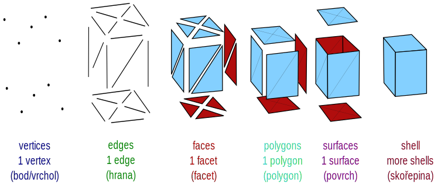
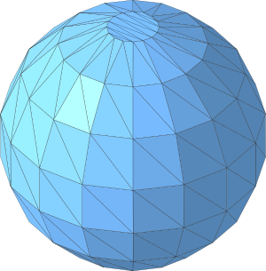
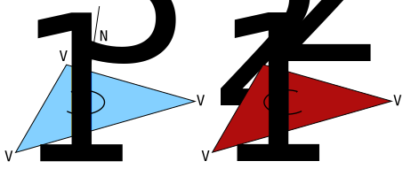
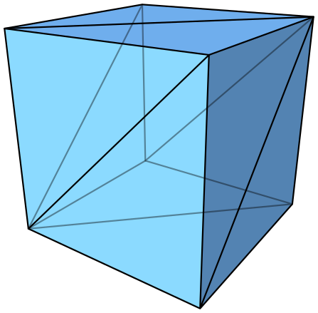
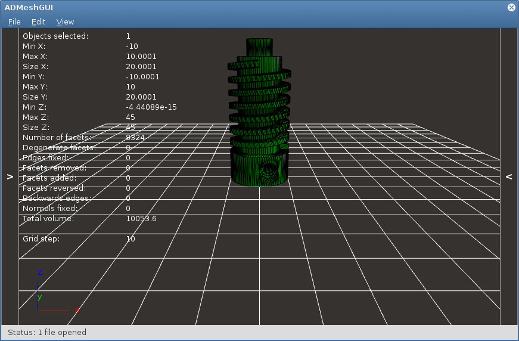
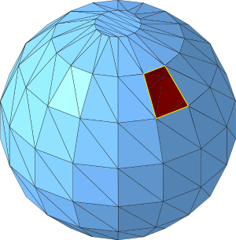
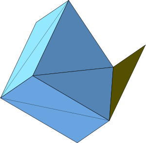
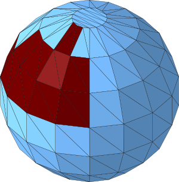
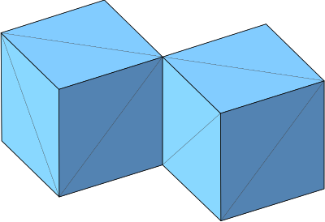
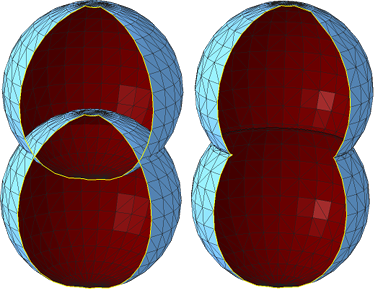

Práce s 3D modely ve formě meshí
--------------------------------

Triangulární mesh
~~~~~~~~~~~~~~~~~

Existuje mnoho způsobů, jak reprezentovat 3D modely. Například
https://en.wikipedia.org/wiki/Constructive_solid_geometry[CSG strom],
jako v OpenSCADu, případně různé objemové oktalové reprezentace apod.

Pro 3D tisk se však nejčastěji používá *hraniční reprezentace*,
konkrétně triangulární mesh (nebo lépe česky trojúhelníková síť). Mesh
je kolekce bodů, hran a stěn (polygonů a facetů) ve trojrozměrném
kartézském souřadném systému. Existuje několik různých druhů takové
meshe, my se budeme zabývat výhradně meshí triangulární, kde facetem
může být pouze trojúhelník. Výhoda trojúhelníku ve 3D prostoru je, že
tři body, neležící na jedné přímce, vždy tvoří trojúhelník (4 body
nemusí v trojrozměrném prostoru ležet v jedné rovině a tvořit
čtyřúhelník).

_Obrázek upraven z
https://commons.wikimedia.org/wiki/File:Mesh_overview.svg[Wikipedie]._

Jednotlivé facety tvoří „vodotěsnou“ hranici mezi vnitřkem a vnějškem 3D
modelu.

Na rozdíl od CSG stromu se mesh vyznačuje tím, že nenese informace o
významu (není například parametrická), na druhou stranu je velmi rychlé
ji vykreslit, nebo dále zpracovávat. V kontextu OpenSCADu můžete vnímat
mesh jako výsledek kompilace.

Formát STL
~~~~~~~~~~

Triangulární mesh lze ukládat v různých formátech. Nejpoužívanějším
formátem pro FDM 3D tisk je *formát STL* (mezi další patří OBJ, AMF, 3MF
a další). STL znamená _STereoLitography_ a je to formát vyvinutý
společností _3D Systems_ v roce 1987 jako univerzální formát pro rapid
prototyping.

Později se objevily významy zkratky jako _Standard Triangle Language_
nebo _Standard Tessellation Language_.

Soubor ve formátu STL obsahuje seznam trojúhelníkových facetů, jejich
vrcholů a normál. Existuje lidsky čitelná
http://en.wikipedia.org/wiki/STL_(file_format)#ASCII_STL[ASCII] a
úspornější
http://en.wikipedia.org/wiki/STL_(file_format)#Binary_STL[binární]
varianta.

Formát STL není otevřeným formátem, ale je velmi rozšířen, podporuje jej
mnoho programů nejen ze světa 3D tisku.

ASCII STL soubor
^^^^^^^^^^^^^^^^

Syntaxe textového STL souboru je poměrně upovídaná. Začíná klíčovým
slovem `solid` a názvem meshe (který není často využívám a bývá
nahrazován názvem programu, který byl použit k vygenerování souboru).
Poté následuje definice všech facetů a soubor končí direktivou
`endfacet` a opět názvem meshe.

(Soubor teoreticky může obsahovat více bloků `solid`, ale v praxi se s
tím často nesetkáte.)

Jeden facet obsahuje informaci o normálovém vektoru a o třech vrcholech.

[source,stl]
----
solid name

facet normal ni nj nk
    outer loop
        vertex v1x v1y v1z
        vertex v2x v2y v2z
        vertex v3x v3y v3z
    endloop
endfacet

...

endsolid name
----

Pořadí vrcholů facetu musí splňovat pravidlo pravé ruky: Jestliže palce
ukazuje ve směru normály (tedy ven z objektu), stočené prsty udávají
pořadí vrcholů.

Jednotlivá čísla se dají reprezentovat jak pomocí notace čísel s
plovoucí desetinou čárkou, tak „lidštějším zápisem“, můžete se tak
setkat např. s hodnotami `1`, `0.5` nebo `2.648000e-002`.

Zde je reálný příklad kostky z OpenSCADu:

[source,stl]
----
solid OpenSCAD_Model
  facet normal -1 0 0
    outer loop
      vertex 0 0 1
      vertex 0 1 1
      vertex 0 0 0
    endloop
  endfacet
...
  facet normal 1 0 0
    outer loop
      vertex 1 0 1
      vertex 1 0 0
      vertex 1 1 1
    endloop
  endfacet
endsolid OpenSCAD_Model
----

http://en.wikipedia.org/wiki/STL_(file_format)#Binary_STL[Binární STL
soubor] obsahuje stejné informace, pouze v úspornější podobě. Čísla jsou
reprezentována datovým typem `float32` v pořadí little endian.

Prohlížení STL souborů
~~~~~~~~~~~~~~~~~~~~~~

STL soubory lze prohlížet v mnoha programech:

* `cat` a `hexdump` pro ty s velkou představivostí 😎
* https://github.com/admesh/ADMeshGUI/[ADMeshGUI] (Linux, macOS,
Windows)
* http://www.freestlview.com/[STLView] (Windows)
* http://www.pleasantsoftware.com/developer/pleasant3d/[Pleasant3D]
(macOS)
* nástroje na úpravu meshe jako http://www.meshlab.net/[MeshLab] nebo
https://github.com/3DprintFIT/netfabb-basic-download[Netfabb]
* modelovací nástroje jako https://www.blender.org/[Blender] apod.

Chyby v triangulární meshi
~~~~~~~~~~~~~~~~~~~~~~~~~~

I syntakticky naprosto správný STL soubor nemusí sémanticky dávat vůbec
smysl. Mnoho STL souborů může vlivem různých faktorů obsahovat řadu
chyb. O meshi, která obsahuje chyby, se říká, že je nevalidní.

Zde si představíme několik častých chyb v STL souborech:

[[neuzavřená-mesh--díra-v-meshi]]
Neuzavřená mesh / díra v meshi
^^^^^^^^^^^^^^^^^^^^^^^^^^^^^^

Mesh není „vodotěsná“ a někde obsahuje díru.

Často díra není způsobena chybějícím facetem, ale nepřesností v číslech
s plovoucí desetinnou čárkou s malou přesností.

image:../images/mesh/mesh_floaterror.svg[Díra v meshi způsobená
floatovou chybou]

Duplicitní facet
^^^^^^^^^^^^^^^^

Na stejném místě se nachází více facetů. Někdy jsou stejně orientované a
plně se překrývají, jindy můžou takové facety tvořit část modelu s
nulovým objemem.

Špatně orientovaný facet
^^^^^^^^^^^^^^^^^^^^^^^^

Orientace facetu je dána pořadím vrcholů a normálou. Tyto informace si
tedy mohou protiřečit. Někdy je také část 3D modelu nebo celý model
otočen „vnitřkem ven“.

Sdílená hrana či stěna
^^^^^^^^^^^^^^^^^^^^^^

Na první pohled nevinná chyba, která ale rozporuje fyzické reprezentaci
3D modelu. Je mezi těmito kostkami úzká mezera, nebo jde úzkou mezerou
projít z jedné kostky do druhé?

Protínající se facety
^^^^^^^^^^^^^^^^^^^^^

Při spojování více skořepin často vniká chyba, kdy se facety navzájem
protínají.

Na obrázku jsou nesprávně (vlevo) a správně (vpravo) spojené koule, díra
v meshi je zde jen pro lepší náhled dovnitř.

Oprava chyb v triangulární meshi
~~~~~~~~~~~~~~~~~~~~~~~~~~~~~~~~

Existuje mnoho programů, které umožňují výše zmíněné chyby opravovat.
Někdy jde o programy na modelování, které „navíc“ umožňují takové chyby
detekovat a poloautomaticky opravovat, někdy jde o specializované
programy.

Blender
^^^^^^^

Z první kategorie zmíníme program Blender, který obsahuje nástroje k
opravě a anylýze meshí. Existuje i
https://store.blender.org/product/blender-for-3d-printing/[výukové DVD]
pro Blender zabývající se 3D tiskem. Pro studenty FIT ČVUT jej máme k
dispozici.

ADMesh
^^^^^^

Mezi programy, které se snaží automaticky opravovat chyby v triangulární
meshi patří command line nástroj http://github.com/admesh/admesh[ADMesh]
či výše zmíněná grafická nadstavba
https://github.com/admesh/ADMeshGUI[ADMeshGUI]. Výsledky ale nejsou
příliš dobré.

Netfabb Basic
^^^^^^^^^^^^^

Nejlepší zkušenost s opravou meshí máme v programu *Netfabb Basic*.
Bohužel tento program není open source a již nadále neexistuje.

Pro Windows lze použít
https://www.autodesk.com/products/netfabb/free-trial[trail verzi
programu Netfabb], která se po vypršení chová jako Netfabb Basic.

Pro ostatní platformy lze využít
https://github.com/3DprintFIT/netfabb-basic-download[naše zálohy
programu Netfabb Basic], které jsou volně šiřitelné.

Na cvičení používáme tento program.

.Pro program Netfabb Basic je k dispozici tento https://www.youtube.com/watch?v=bl1AIYqPvcE[videotutoriál].
video::bl1AIYqPvcE[youtube]

Soubory
~~~~~~~

* link:../stls/mesh/cube_bad.stl[cube_bad.stl] – kostka z videa s
chybami
* link:../stls/mesh/cube_correct.stl[cube_correct.stl] – kostka z videa
bez chyb
* link:../stls/mesh/aligator_mini_bad.stl[aligator_mini_bad.stl] –
aligátor z videa (https://www.thingiverse.com/thing:21724[originál CC
BY-SA Joseph Larson])
* link:../stls/mesh/bunny_trouble_piece.stl[bunny_trouble_piece.stl] –
králík z videa (https://www.thingiverse.com/thing:7578[CC BY-NC mrbug])
* link:../stls/mesh/tajmahal.stl[tajmahal.stl] – nebodovaná úloha na
procvičení (https://www.thingiverse.com/thing:11183[CC BY-SA Nicholas
Wilson])
