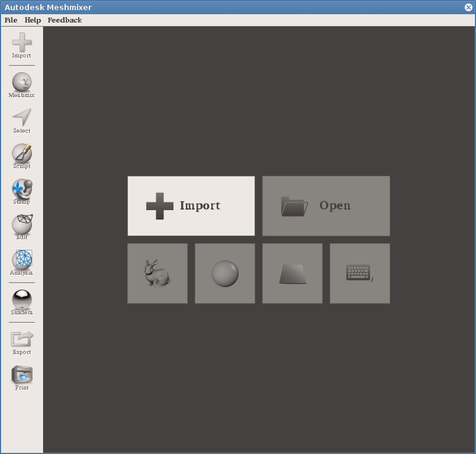
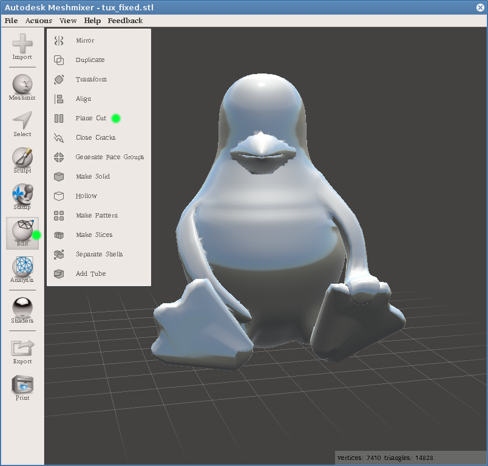
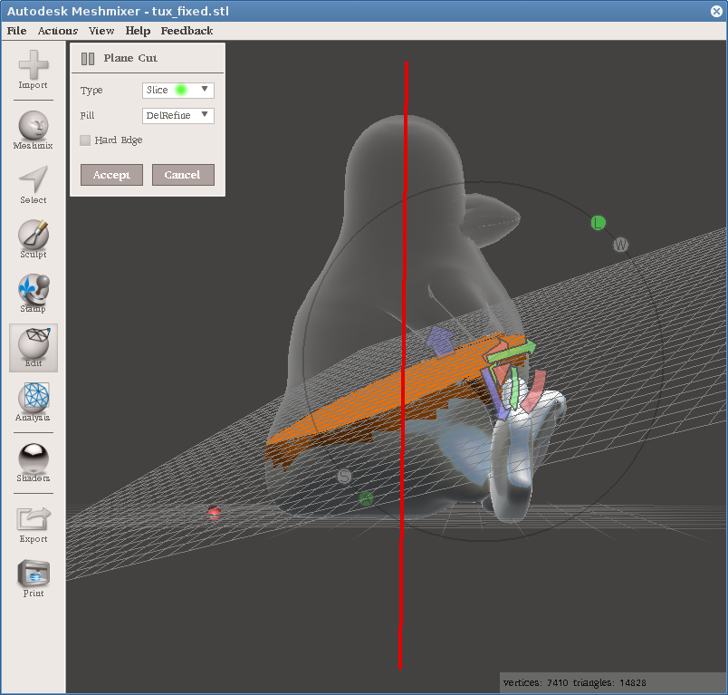
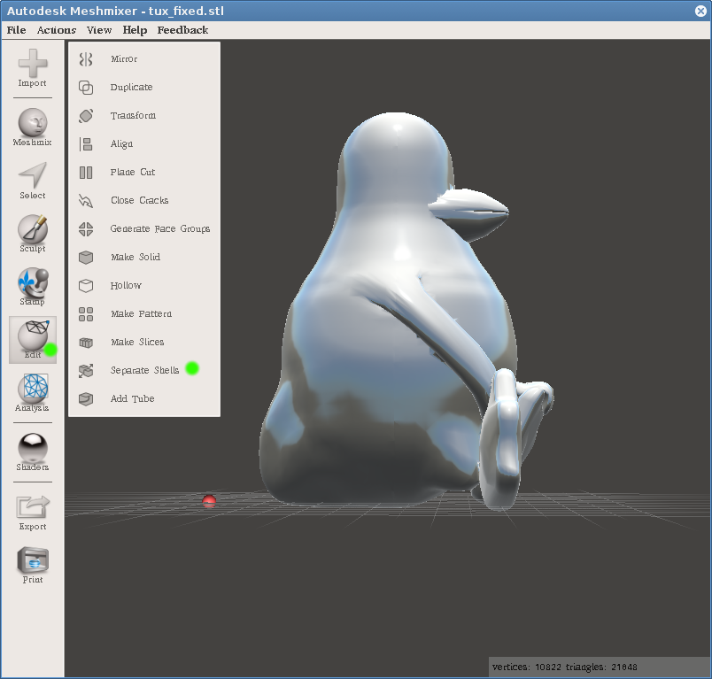
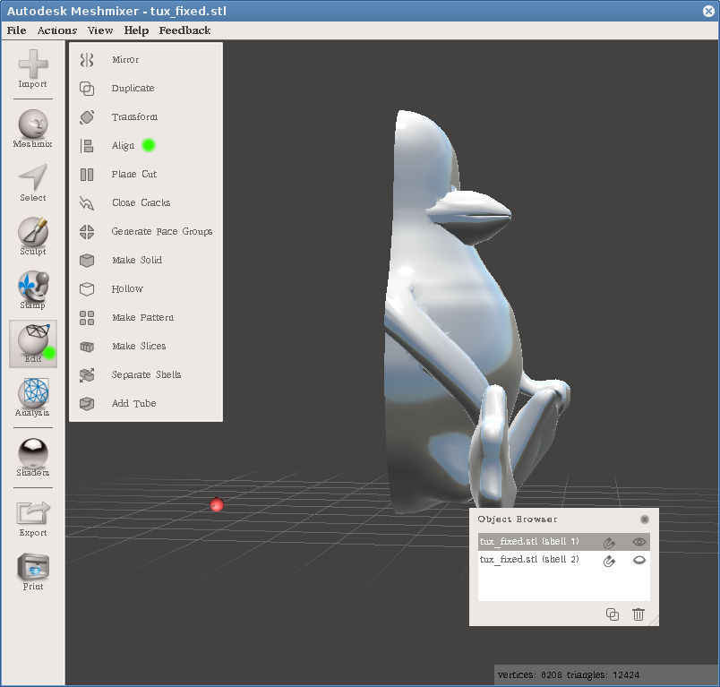
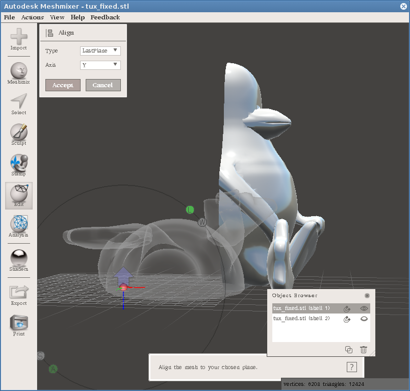
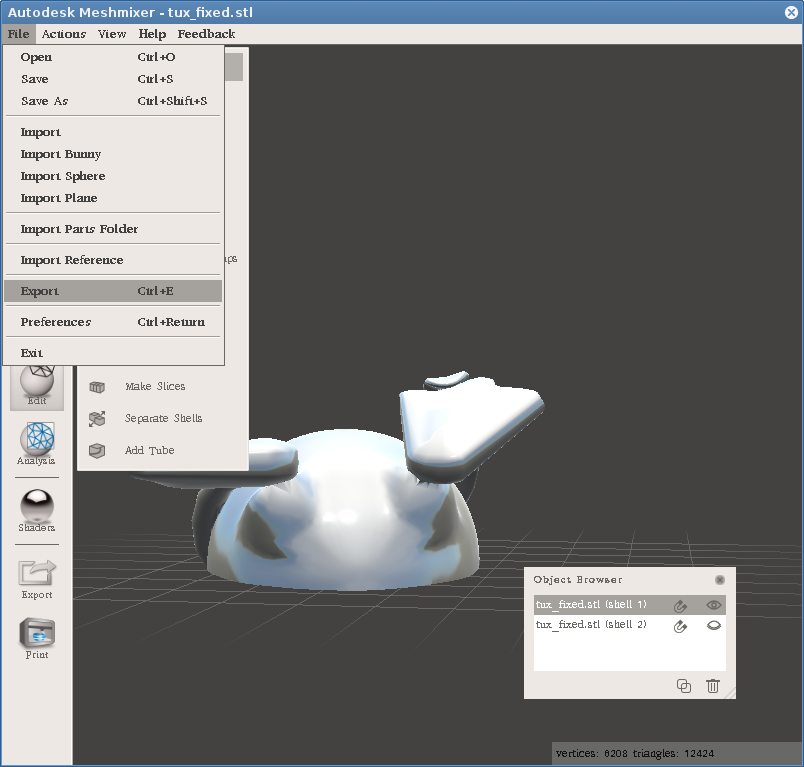
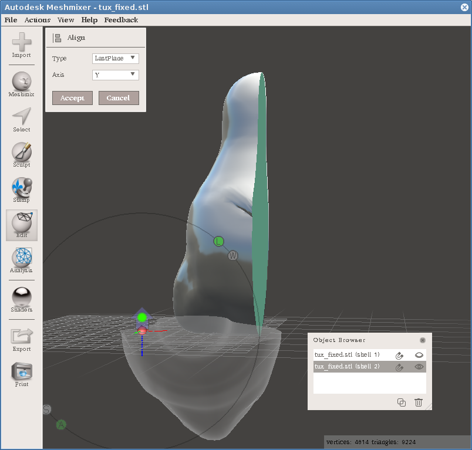
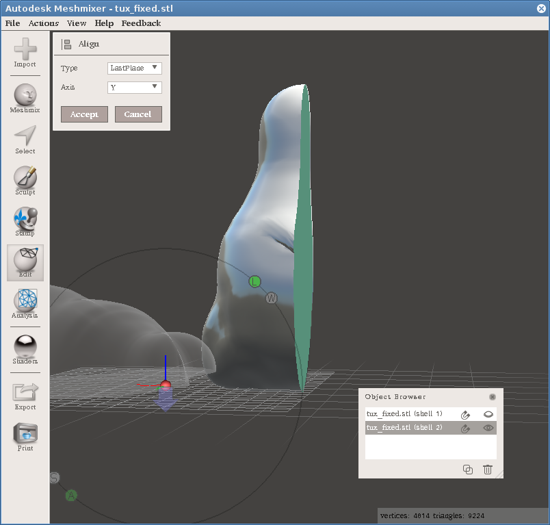
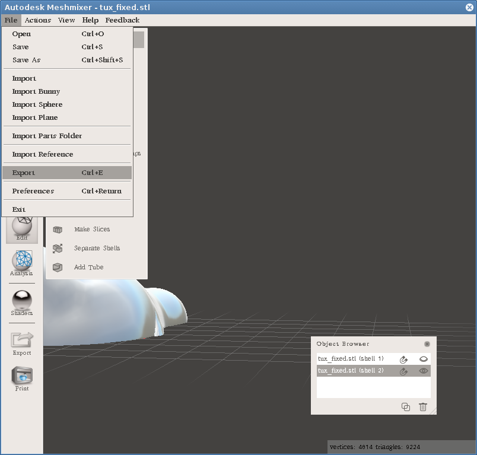

MeshMixer a řezání STL souborů
------------------------------

Aktuální MeshMixer 3.2 najdete na http://www.meshmixer.com/[stránkách
programu]. Existuje verze pro Windows a macOS.

Existoval experimentální balíček pro Ubuntu 14.04 (můžete si z něj
relativně jednoduše udělat
https://github.com/hroncok/meshmixer-docker/blob/master/README.md#how-to-create-meshmixer-appimage[AppImage]
a spouštět ho na jiných distribucích, nebo si ho vzít z fakultního
počítače).

Video návody jsou vytvořeny na verzi 2.9:

https://www.youtube.com/watch?v=cVx1vXq8Xao[Řezání objektů v MeshMixeru]

Cura je dostupná ve dvou variantách, já doporučuji stáhnout
https://www.lulzbot.com/cura[Cura Lulzbot Edititon] nebo
https://ultimaker.com/en/products/cura-software/list[starší verzi
Ultimaker Cura (15.x)] (nová verze je celá předělaná a návod nebude
souhlasit).

https://www.youtube.com/watch?v=FNOLtlEaJKA[Pokládání objektů v Cuře]

Mohlo by se vám také hodit:
https://www.youtube.com/watch?v=SiBXboixe2g[Převisy v Cuře (bez
komentáře)] a https://www.youtube.com/watch?v=1U4MVuaSv0U[Řezání modelů
ve Slic3ru]

[[meshmixer-24]]
MeshMixer 2.4
~~~~~~~~~~~~~

Tato část návodu (bez videí) je pro velmi starou verzi MeshMixeru, ale
vystačíte si s jedním programem.

Instalace
^^^^^^^^^

MeshMixer 2.4 najdete na http://www.meshmixer.com/[stránkách programu].
Existuje verze pro Windows a macOS. V Linuxu jde verze pro Windows
nainstalovat pomocí programu Wine, jen musíte do složky s programem
(obvykle `~/.wine/drive_c/Program Files/Autodesk/Meshmixer/`) dodat
soubory http://www.dllme.com/dll/files/mfc110u_dll.html[mfc110u.dll] a
http://www.dllme.com/dll/files/prntvpt_dll.html[prntvpt.dll]. Jediný
problém, se kterým jsme se setkali, jsou divné fonty a crash při prvním
spuštění.

image:../images/meshmixer/meshmixer1.png[Screenshot]

Řez objektem
^^^^^^^^^^^^

Nejprve importujte STL soubor pomocí tlačítka *Import*.

Poté z nabídky *Edit* vyberte *Plane Cut*.

Pomocí všelijakých šipek můžete manipulovat rovinou řezu. Můžete také
táhnout stisknutou myš a vytvořit čáru (na obrázku červená), podél které
se rovina přemístí, rovnoběžně s vaším pohledem. Pokud je objekt umístěn
nepříhodně, můžete s ním rotovat pravým tlačítkem myši. Před stisknutím
tlačítka *Accept* se ujistěte, že máte vybráno *Type: Slice*, jinak
skončíte pouze s jednou částí objektu.

Po provedení řezu vypadá objekt stejně jako předtím. Musíte opět z menu
*Edit* vybrat *Separate Shells*.

V modálním okně můžete vybírat, který shell bude vidět, případně na
jakém se provádí akce (pozor, to je rozdíl, jedno řeší to očičko, druhé
řeší jakoby zvolení a zvýraznění toho shellu v seznamu). Rovnou pro
jeden shell vyberte z nabídky *Edit* možnost *Align*. To proto, aby
objekt ležel na placaté části, jinak byl řez k ničemu.

V dialogu *Align* je vybrána ve výchozím stavu osa Y. To by snad mělo
zajistit položení objektu na plocho (i když možná vzhůru nohama, k tomu
se dostaneme), takže stačí dát *Accept*.

Z menu *File* zvolte *Export* a uložte danou část jako STL soubor.
Doporučuji zkontrolovat, že jste vyexportovali správnou část (otevřením
výsledného STL v nějakém programu).

Postup zopakujte pro druhou polovinu. Zde nastal případ, že *Align*
otáčí objekt jinak, než chceme. Stačí kliknout na šipku (označenou
zeleným puntíkem) a pokračovat jako u předchozí části.

