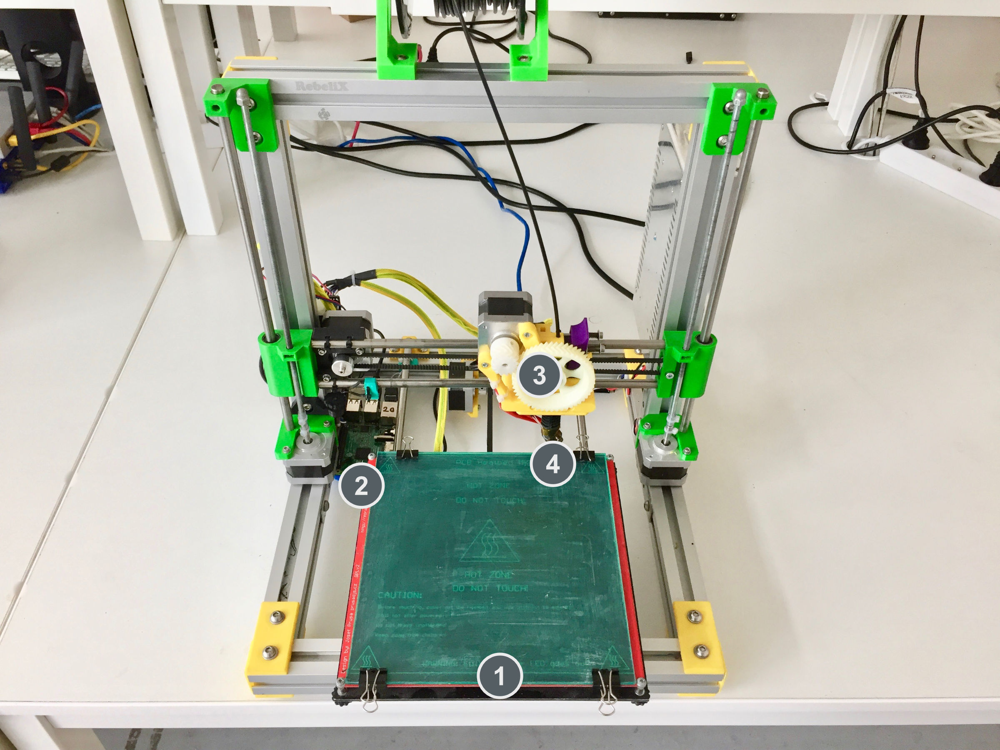
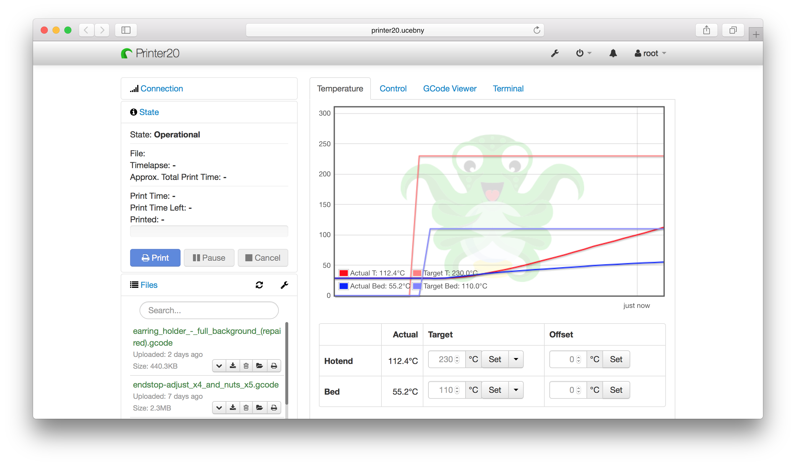
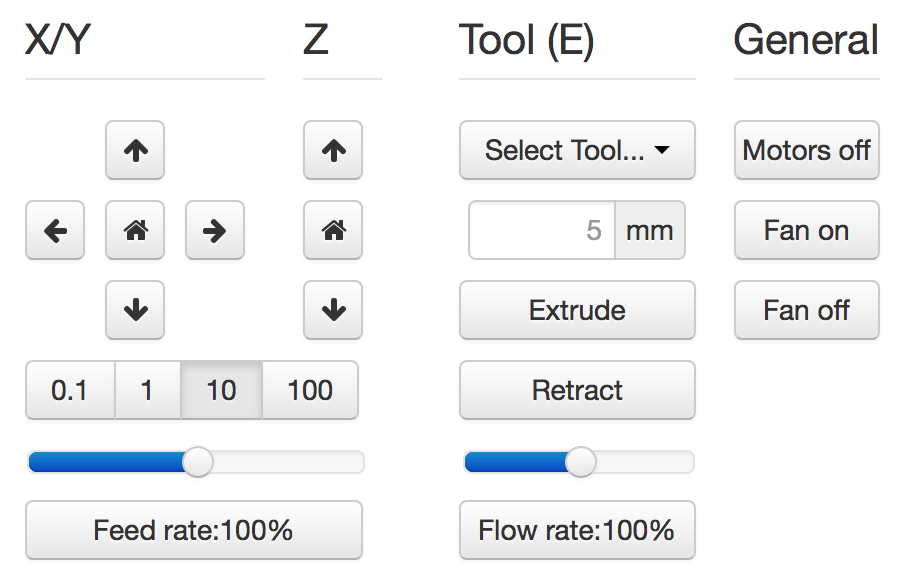
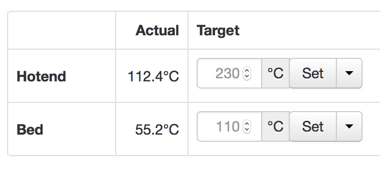
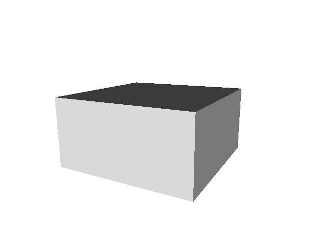
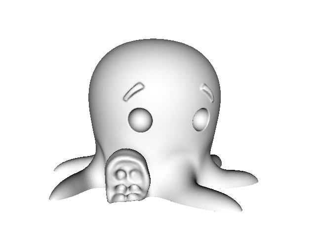
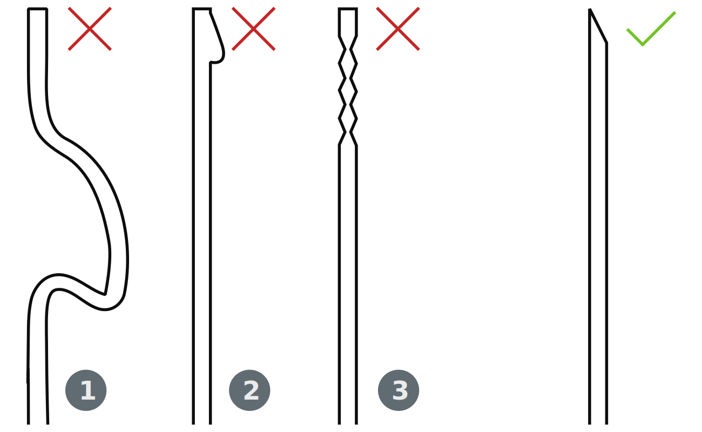

= Tisk
Marián Hlaváč <marian.hlavac@fit.cvut.cz>
:toc:

Tento týden se konečně dostaneme k tomu, na co jsme se všichni jistě celou dobu těšili. 
Využijeme získané teoretické znalosti a uplatníme je prakticky.

Seznámíme se s tiskárnou, vysvětlíme si, k čemu jsou určeny její jednotlivé části a připravíme ji k tisku. 
Seznámíme se s nástroji, kterými budeme přenášet tisková data a spouštět tisk a závěrečně na tiskárnách něco vytiskneme.
 
[.noclear]
TIP: Pokud již 3D tiskárny znáte, můžete některé kapitoly v textu vynechat, ale nevynechávejte kapitolu <<Příprava tiskárny>>, je povinná pro všechny. Až pak můžete pokračovat čtením <<Zadání úkolů, zadaných ukolů>>.

== Seznámení se s tiskárnou

Na stole před vámi by měla ležet FDM tiskárna http://reprap4u.cz/rebelix/[_RebeliX_] a jedna či dvě špule materiálu ABS.

Na fotografii níže se seznamte s pojmy, které budou dále ve studijním textu zmíněny.

.Tiskána RebeliX

<1> Tisková deska (heatbed)
<2> Raspberry Pi
<3> Extruder
<4> Tryska (hotend)

== Ovládání tiskárny

Tiskárnu nebudeme ovládat přímým připojením k počítači, ale zodpovědnost za přenos tiskových dat přenecháme mini-počítači https://en.wikipedia.org/wiki/Raspberry_Pi[Raspberry Pi], který je součástí každé tiskárny v učebně.

Každé Raspberry Pi je připojeno do školní sítě a je možné jej na dálku instruovat, jak má ovládat tiskárnu a která data přenášet. Tento úkol nám usnadní webové rozhraní OctoPrint.

=== Připojení k tiskárně

K připojení do sítě ve které jsou tiskárny přístupné, využijte školní počítače.
Na každé tiskárně lze nalézt štítek uvádějící číslo tiskárny. 
Připojte se na svou tiskárnu nahrazením `X` za číslo vaší tiskárny v níže uvedené adrese.

Adresa tiskárny:: http://printerX.ucebny

K přihlášení použijte níže uvedené přihlašovací údaje. Heslo sděluje cvičící.

Jméno:: student
Heslo:: _sdělí cvičící_

Pokud se na tiskárnu nelze připojit, vyzkoušejte xref:../troubleshooting/printing.adoc#_na-tiskárnu-se-nelze-připojit[jiné možnosti].

CAUTION: Po připojení se ujistěte, že se jedná o rozhraní pro vaši tiskárnu, která vám leží na stole. Ač sabotování tisku spolužákům se může zdát jako legrace, vězte, že není.

=== OctoPrint

https://github.com/foosel/OctoPrint[OctoPrint] je jednoduché a přehledné webové rozhraní pro ovládání tiskáren připojených k počítači (v našem případě k Raspberry Pi). Umožňuje tiskárnu ručně ovládat, zobrazit přehledně její stav a odesílat tisková data na tiskárnu.

.Snímek prohlížece s otevřeným OctoPrint rozhraním

.Ruční ovládání v OctoPrint

==== Ruční ovládání

Na kartě ručního ovládání (Control) lze, jak název napovídá, ručně ovládat tiskárnu.
Můžete posouvat tiskovou hlavu ve všech třech osách a také ovládat extruder. 

První sloupec je velmi intuitivní, šipky představují směry, do kterých můžete tiskovou hlavu posunout.
Ikona domečku představuje akci "home", která vyresetuje pozici tiskárny na `[0, 0, 0]` a zároveň sesynchronizuje fyzickou pozici tiskové hlavy s údaji v kontroléru tiskárny.

Tlačítka `0.1`, `1`, `10` a `100` představují hodnotu o kterou posunete tiskovou hlavu následným kliknutím na šipku směru.
Před posunem tlačítky je však nutné tiskárnu vždy uvést do stavu "home", aby tiskárna nevyjela mimo hranice.
Pokud byste násilím posouvali osy mimo hranice, můžete tiskárnu poškodit.

V druhém sloupci lze ovládat extruder. 
V číselném poli lze nastavit kolik milimetrů materiálu bude extrudováno/retractováno a tlačítky pod ním lze příslušnou akci provést.
Ovládání extruderu je zvláště užitečné při vyjímání či zavádění filamentu.

V posledním sloupci je užitečné tlačítko `Motors off`, který vypne krokové motory tiskárny a s tiskovou deskou a extruderem lze hýbat ručně.

.Ovládání teplot v OctoPrint

==== Předehřátí tiskárny

Předehřívání trvá v řádech minut. 
Pro urychlení práce nebo pro zavedení či vyjmutí filamentu je nutné tiskárnu zahřát.

Ve spodní části na kartě "Temperature" je možné nastavit teplotu, na kterou se má tiskárna zahřát.
Vepsáním teploty do číselného pole ve sloupic "Target" a kliknutím na "Set" lze nastavit teplotu. 
V rozbalovacím menu jsou pro rychlé nastavení přednastavené hodnoty pro ABS a PLA.

==== Tisk

Návod k tisku popisuje kapitola <<Tisk krok za krokem>>. 
Přečtěte si nyní zadání úkolů, abyste věděli co se od vás očekává, a pak pokračujte návodem jak tisknout krok za krokem.

== Zadání úkolů

Pro dnešní sadu úkolů se vtělte do pracovitého zaměstnance QC oddělení fiktivní firmy "Pepa Prča Research", kontrolující výstupní kvalitu 3D tiskáren.
Vaším úkolem bude ověřit, zda tiskárna tiskne správně a jak dobře.

=== Úkol 1 (1 bod)

Vašim prvním úkolem je *ověřit, zda tiskárna skutečně vytiskne stejné rozměry, které jsou v modelu.*

Jako testovací objekt jste si vybrali link:../stls/printing/20mm-box.stl[model kostky o přesných rozměrech 20×20×10 mm].
K tiskárně jste dostali tiskový profil, který na ní byl doteď používán. 
Předpokládejme, že není potřeba ho upravovat po kalibrační stránce (hodnoty jako velikost trysky a údaje o materiálu jsou správné). 

Abyste ušetřili materiál, nastavte tisk tak, aby se vytiskly kostky 4 a každá z nich byla dutá, měla jednu obvodovou vrstvu a žádnou vrchní vrstvu (ve výsledku byste měli dostat 4 hranaté kalíšky).

=== Úkol 2 (2 body)

Dále chcete *ověřit jak moc malý předmět tiskárna zvládne vytisknout*. 

Jako testovací objekt jste si vybrali https://www.thingiverse.com/thing:27053["Cute Octopus Says Hello"] (CC BY 3.0) od MakerBot ze serveru Thingiverse.com (link:../stls/printing/CuteOcto.stl[mirror zde]), profil použijete stejný jako výše. Abyste ušetřili materiál, začnete na poloviční velikosti předmětu (scale 50%) a budete dále zkoušet menší velikosti, podle toho, kolik vám zbyde času (zkuste pak např. 33%, 25%, 15% atd.).

Odevzdávat budete jednu poloviční velikost (scale 50%) a druhou libovolně menší (scale <50%), ale povedenou. Další menší velikosti můžete odevzdat dobrovolně, ale neovlivní výsledný počet bodů

=== Úkol 3 (0 bodů, ale povinný)

*Ukliďte po sobě své pracoviště.* Kdo po sobě neuklidí, nedostane žádné body.

== Tisk krok za krokem

Kapitola vás provede tiskem krok za krokem. 
Většinu z těchto informací se dozvítě osobně na cvičení, nicméně pokud se dostanete do situace, kdy si nejste jistí, nebo jste instrukce ze cvičení přeslechli nebo z paměti vytěsnili, tento průvodce by vám měl být pomocníkem.

=== Příprava tiskárny
 
Před spuštěním tisku je potřeba dodržet několik kroků. 
V případě, že tiskárnu nezkontrolujeme, můžeme skončit se špatným výtiskem, nebo v horším případě s poškozenou tiskárnou.

. Vizuálně se ujistěte, že tiskárna není nijak zjevně poškozená (porovnejte např. s fotografií výše).
. Očistěte tiskovou desku od nečistot či pozůstatcích předchozích výtisků.
. Zkontrolujte a případně <<Zavedení filamentu, zaveďte filament>>. Ujistěte se, že se špule může při tisknu volně otáčet a nezasekne se.
. Zajistěte, aby deska při tisku nenarážela do věcí na stole. Buď je může shodit, nebo se o ně zaseknout a tisk se pak nepovede.

==== Vyjmutí filamentu

Abychom mohli vyjmout filament z tiskárny, musí <<Předehřátí tiskárny, být zahřátá>> na teplotu tání materiálu.
Pokud byste tiskárnu nezahřáli, mohl by se filament v extruderu zlomit a způsobit problémy.

Zahřejte tiskárnu na požadovanou teplotu a v rozhraní OctoPrint se přepněte na kartu <<Ruční ovládání, ručního ovládání>>, a klikněte na tlačítko `Retract`.

Po celou dobu vytahování mějte ruku poblíž struny, jelikož po jejím úplném vytažení má struna tendenci vystřelit a zamotat se. Vyjmutou strunu vložte do malého očka na špuli, aby se filament nezačal zamotávat. Buďte při manipulaci s filamentem opatrní. Špuli sundejte z držáku a filament odložte.

==== Zavedení filamentu

Pravidlo předehřáté tiskárny platí úplně stejně jako u vytahování filamentu.

Zkontrolujte zakončení filamentu na závady. Filament může být:

. Nerovný či polámaný
. Mít roztavené zakončení
. Být "nahlodaný" od ozubení extruderu

V každém případě takovou část uřízněte, nebo odlomte.

Zařízněte filament do špičky a vložte jej do otvoru na extruderu. Netlačte filament do tiskárny násilím, stačí jen vložit a jemně přitlačit a v OctoPrintu na kartě <<Ruční ovládání, ručního ovládání>> klikněte na tlačítko `Extrude`.

Ve chvíli, kdy tiskárna uchopí filament můžete jej pustit. Extrudujte filament tak dlouho, dokud nezačne z trysky vytékat plast. Dále extrudujte plast tak dlouho, dokud nezačne z trysky vytékat plast správné barvy (v trysce mohly být pozůstatky filamentu jiné barvy).

==== ABS Juice

K vylepšení přilnavosti tiskové desky se používají různé materiály - lepidla, ABS Juice, laky.

Pokud tisknete předmět, který by se mohl v průběhu tisku odlepit, naaplikujte na desku *jemnou vrstvu* ABS Juice. 
V učebně je k dispozici ABS Juice, používejte, prosím, na tiskárny v učebně pouze ten. 

Není nutné nanášet ABS Juice na desku ve velkém množství. Tlusté nánosy na tiskárně jsou nežádoucí. 

WARNING: ABS Juice je malé množství ABS rozpuštěné v acetonu. Aceton je nebezpečná látka, dbejte zvýšené opatrnosti. *V případě kontaktu s nekrytou částí těla okamžitě kontaktujte cvičícího.* Při manipulaci zkontrolujte, že je otevřené okno. Ihned po vyjmutí štětce nádobu zavřete. Ponechání otevřené nádoby s acetonem bez dozoru je vážné porušení BOZP.

=== Tisk

Nahrajte tisková data (ve formátu GCode) na Raspberry Pi použitím ovládacího prvku "Files" v levém dolním rohu rozhraní OctoPrintu. Přípravou tiskových dat do formátu GCode se zabývala kapitola xref:./slicing#[Slicing].

Pokud máte vše připraveno, můžete kliknout ikonku tisku u vašeho právě nahraného souboru.
Pokud chcete zkontrolovat váš gcode, klikněte na ikonku složky.
Tím se váš soubor nastaví jako aktivní, můžete si prohlédnout načtené statistiky, či ověřit jeho správnost na kartě "GCode Viewer" a tisk spustit až následným kliknutím na větší tlačítko "Print" v části rozhraní nazvané "State". 

Pokud při tisku narazíte na jakýkoliv problém, konzultujte se cvičícím, nebo zkuste problém najít v xref:../troubleshooting/index#[troubleshootingu].

=== Po dokončení tisku

Pomocí hrany nožíku (nikdy ne pomocí špičky) se pokuste od tiskové desky odlepit celou základnu vašeho výtisku nebo alespoň její větší část.
Velmi opatrně pak odlepte rukou výtisk z desky. 

Proces odstraňování výtisku z tiskové desky neuspěchejte. 
Dávejte pozor, abyste nepoškodili svůj výtisk nebo tiskovou desku.

WARNING: Dodržujte pravidla bezpečné práce, abychom předcházeli zranění. Nože jsou ostré a hotendy tiskárny jsou po dokončení tisku stále horké a hrozí popálení. Buďte opatrní. *Pokud ke zranění dojde, okamžitě kontaktuje cvičícího.*

Po skončení tisku a práce s tiskárnou (na konci cvičení) nezapomeňte <<ukol-3, své pracoviště uklidit>>. Vyčkejte, než tryska vychladne (cca pod 100℃) a odpojte ji od elektrické sítě.