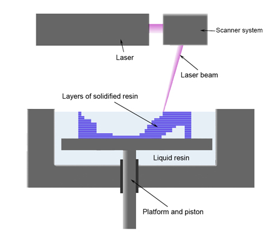
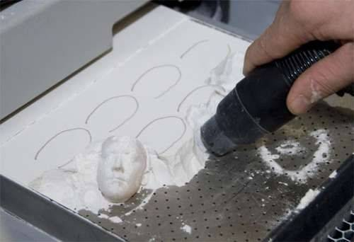
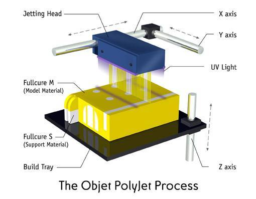
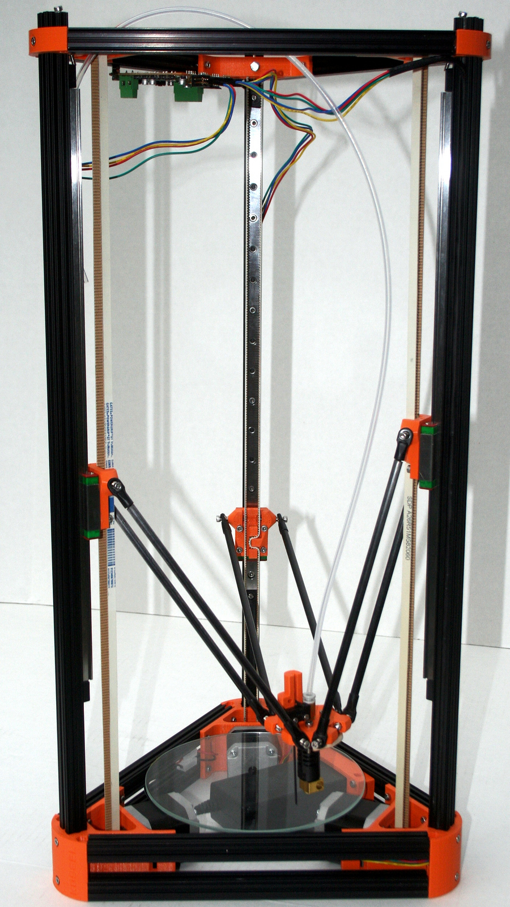

Technologie tisku a RepRap
--------------------------

Proč 3D tisk?
~~~~~~~~~~~~~

* levná a rychlá výroba prototypů (v řádu hodin)
* snadné přenesení grafických návrhů do fyzické podoby
* nejsme dostatečně zruční abychom si to vyrobili sami
* nechceme sériovou výrobu
* zábava 😎

Základní princip
~~~~~~~~~~~~~~~~

Jak to celé funguje?

Všechny technologie 3D tisku mají společný základní princip kladení
vrstev na sebe, kterému se říká aditivní výroba. Je to opačný proces k
obrábění materiálu. Místo toho, aby byl objekt z kusu materiálu vyřezán,
je z materiálu postupně vyráběn.

3D model je "rozřezán" na tenké vrstvy, které se pak v tiskárně kladou
na sebe. Můžeme si to představit, jako kdybychom chtěli za pomocí stolní
tiskárny vyrobit 3D objekt z papíru. Nejprve vytiskneme všechny potřebné
vrstvy, poté nůžkami vystříháme a nalepujeme na sebe.

Stereolitografie (SLA)
~~~~~~~~~~~~~~~~~~~~~~

Metoda vytváření objektů z tekutého polymeru, který je postupně
vytvrzován pomocí záření různých vlnových délek.
https://www.youtube.com/watch?v=NM55ct5KwiI[Video]

(Obrázek z
https://commons.wikimedia.org/wiki/File:Stereolithography_apparatus.jpg[Wikipedie]
© Materialgeeza (CC BY-SA).)

Práškový tisk (SLS, DMLS)
~~~~~~~~~~~~~~~~~~~~~~~~~

Technologie je založena na kladení tenkých vrstev prášku a následného
vytvrzení pouze potřebných míst. Vytvrzení může probíhat buď zapečením
prášku laserem (například kov, DMLS), nebo použitím tekutého polymeru a
ozářením většinou UV zářením.
https://www.youtube.com/watch?v=9E5MfBAV_tA[Video SLS],
https://www.youtube.com/watch?v=bgQvqVq-SQU[Video DMLS]

(https://www.prlog.org/12539309-3d-printing-powder-market-analysis-till-2021-download.html[Obrázek]
© PRLog.)

PolyJet
~~~~~~~

Podobně jako v inkoustových tiskárnách je polymer vytryskáván z tiskové
hlavy pomocí miniaturních trysek. Následně je vrstva vytvrzena UV
paprskem. https://www.youtube.com/watch?v=ZjXh1RJfA34[Video]

(Nedokážeme dohledat původ obrázku, pomůžete nám? Na internetu je příliš
rozšířený.)

FFF/FDM/Thermoplastic extrusion
~~~~~~~~~~~~~~~~~~~~~~~~~~~~~~~

FFF (fused filament fabrication) nebo FDM (Fused Deposition Modeling) je
technologie, která je založena na principu "tavné pistole". Plast je
tlačen do trysky, kde je roztaven a následně je kladen na podložku.
https://www.youtube.com/watch?v=WHO6G67GJbM[Video]

image:../images/reprap/fdm_by_zureks.png[FDM]

(Obrázek z
https://commons.wikimedia.org/wiki/File:FDM_by_Zureks.png[Wikipedie] ©
Zureks (CC BY-SA).)

_1 - tryska vytlačující plast, 2 - vymodelovaná část objektu, 3 -
pohybující se platforma_

RepRap
~~~~~~

* Adrian Bowyer, University of Bath 2006
* RepRap Darwin, 2007
* RepRap Mendel, 2009
* 3DPrintLab, 2012

Více na
http://reprap.org/wiki/RepRap_history[reprap.org/wiki/RepRap_history].

Technologie RepRap
~~~~~~~~~~~~~~~~~~

FFF/FDM - technologie tavení plastového drátu (termoplastu) v trysce.
Principem RepRap tiskárny je částečná replikace sebe sama.

Výhody
^^^^^^

* Levné (Pořizovací náklady cca 10000 Kč, cena plastu cca 0.7 Kč/g)
* OpenSource/OpenHardware

Nevýhody
^^^^^^^^

* Pořízení první tiskárny (slepice/vejce)

Základní modely RepRap
~~~~~~~~~~~~~~~~~~~~~~

image:../images/reprap/reprap_darwin.jpg[RepRap Darwin]

(© http://reprap.org/wiki/File:RepRapOneDarwin-darwin.jpg[Adrian
Bowyer], GNU FDL)

image:../images/reprap/reprap_v2_mendel.jpg[RepRap Mendel]

(© http://reprap.org/wiki/File:Mendel.jpg[Adrian Bowyer], GNU FDL)

image:../images/reprap/rostock.jpg[Rostock]

(© http://reprap.org/wiki/File:Rostock.jpg[Johann C. Rocholl], GNU FDL)

Fork-modely
~~~~~~~~~~~

image:../images/reprap/huxley.jpg[Huxley]

(© https://www.root.cz/galerie/linuxalt-2012/#29[Petr Krčmář, root.cz],
použito se svolením)

image:../images/reprap/assembled-prusa-mendel.jpg[Prusa Mendel]

(© http://reprap.org/wiki/File:Assembled-prusa-mendel.jpg[Josef Průša],
GNU FDL)

image:../images/reprap/prusai3-metalframe.jpg[Prusa i3]

(© http://reprap.org/wiki/File:Prusai3-metalframe.jpg[Bitflusher], GNU
FDL)

image:../images/reprap/rebel2.jpg[Rebel 2]

(© https://www.clexpert.cz/3dtisk/rebel2/[Petr Zahradník], fair use)

image:../images/reprap/rebelix.jpg[RebeliX]

(vlastní foto)

(© http://reprap.org/wiki/File:Kossel.jpg[Johann C. Rocholl], GNU FDL)

Speciální typy
~~~~~~~~~~~~~~

image:../images/reprap/morgan.jpg[Morgan]

(© http://www.morgan3dp.com/reprap-morgan-source/[Morgan 3D Printers],
GPLv2)

image:../images/reprap/foldarap.jpg[FoldaRap]

(© https://www.thingiverse.com/thing:15877[Emmanuel], GPLv2)

Vstupní formát (Slicing)
~~~~~~~~~~~~~~~~~~~~~~~~

*STL* (STereoLitography) -- mesh trojúhelníků, popisuje povrchovou
geometrii modelu.

Exportovaný z jakéhokoliv 3D modelovacího programu. Více informací v
kapitole xref:mesh#[Práce s meshí].

Vstupní formát tiskárny
~~~~~~~~~~~~~~~~~~~~~~~

*GCode* -- instrukce pro tiskárnu

Příklad:

[source,plain]
----
G1 X10 Y10 Z10 E10
M220 S150 
----

Tiskové materiály
~~~~~~~~~~~~~~~~~

SLA
^^^

Fotopolymer - pro domácí použití příliš drahý

SLS
^^^

Práškový materiál (kov nebo plast)

FDM/FFF
^^^^^^^

Plastový materiál v drátu

* ABS - lego a tiskárny
* PLA - ekologický
* Nylon - vysoce odolný
* PVA - rozpustný ve vodě
* https://www.youtube.com/watch?v=Vmb9iwFpaOs[FilaFlex] - elastický
