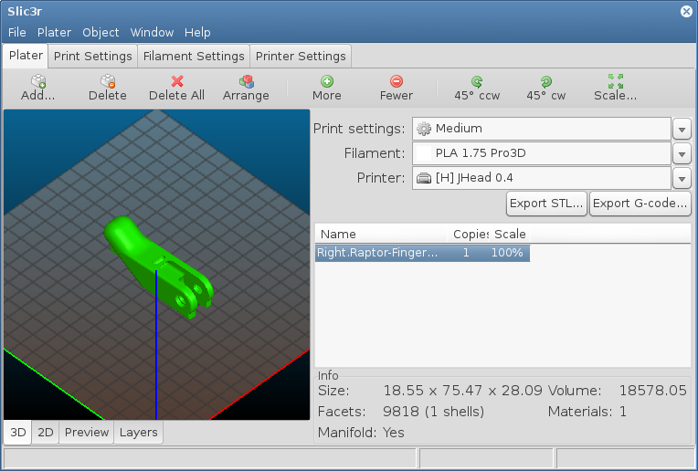
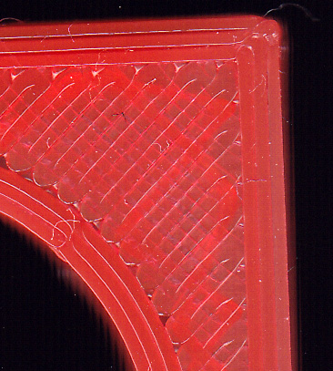
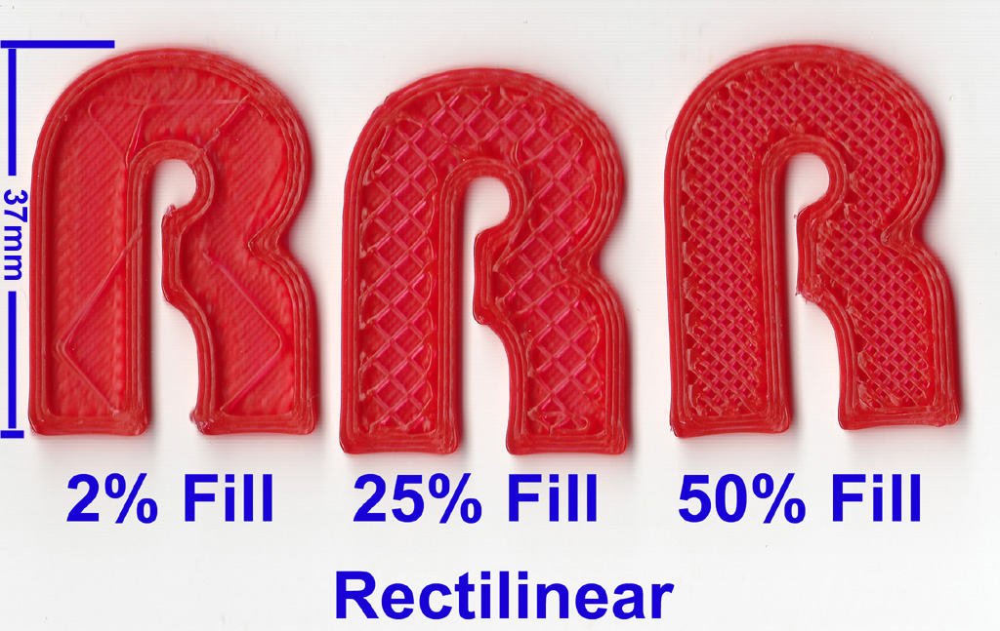
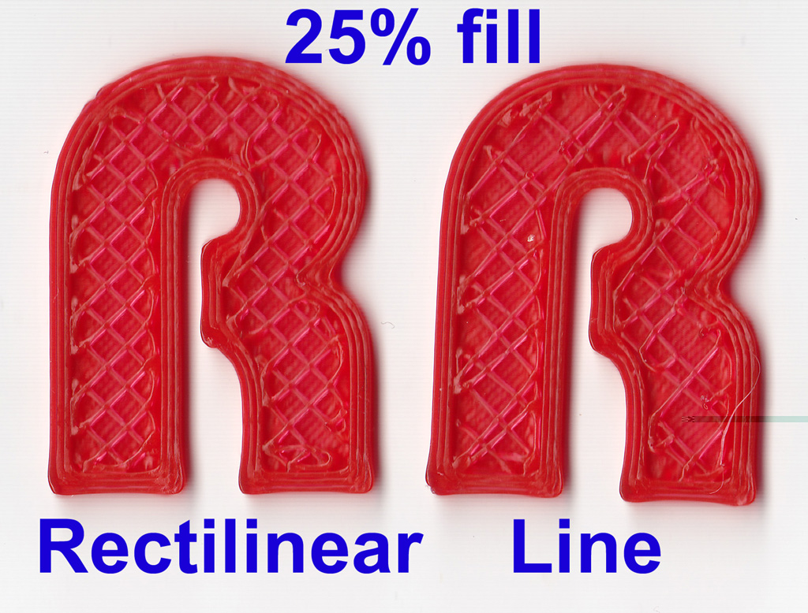
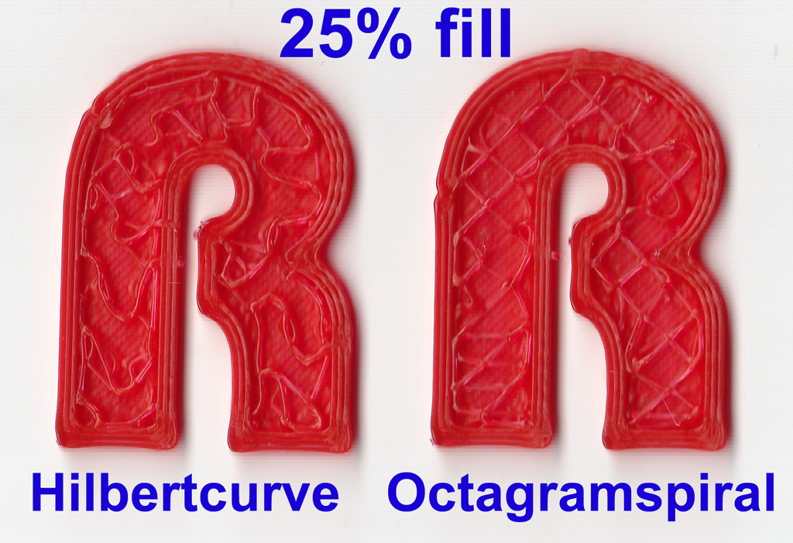
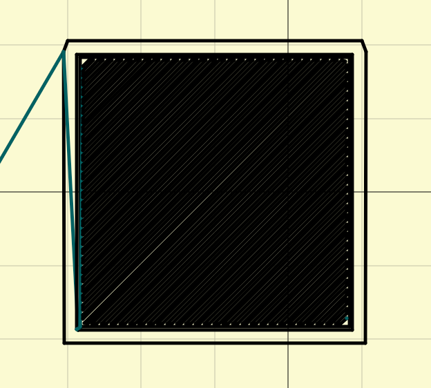

Slic3r
------

Program Slic3r
~~~~~~~~~~~~~~

* OpenSource nástroj pro generování GCode
* Více na http://slic3r.org[Webu projektu]

Ukázka
~~~~~~

Další fotografie z článku jsou © Richard Horne, z článků odkázaných na
konci stránky.

Panely
~~~~~~

* Plater - Na rozložení objektů po tiskové ploše
* Print Settings - Veškerá nastavení tisku, jako rychlost, výplň,
podpory, atd.
* Filament Settings - Nastavení specifické pro materiál. Teploty,
průměr, chlazení.
* Printer Settings - Nastavení specifické pro tiskárnu. Průměr trysky,
velikost tiskové plochy, atd.

Pozn.: Jelikož jsme experti, tak budeme pracovat v Expert režimu. Režim
se přepíná v _File | Preferences_.

Printer Settings
~~~~~~~~~~~~~~~~

* General
** Nastavení rozměrů tiskárny
** Typ firmwaru
** Počet extruderů
* Custom G-code
** Vlastní definice startu a konce souboru
* Extruder X
** Průměr trysky
** Offset, pokud máme více trysek vedle sebe
** Rectraction
*** Eliminace tlaku v trysce

Filament Settings
~~~~~~~~~~~~~~~~~

* Filament
** Průměr materiálu
** Teploty
* Cooling
** Chlazení objektů, aby se nepřehřívaly/nedeformovaly

Print Settings
~~~~~~~~~~~~~~

Layers and Perimeters
^^^^^^^^^^^^^^^^^^^^^

Výška vrstvy
++++++++++++

Ideální výška je okolo 0,2mm

image:../images/slic3r/layer_height_comparison.jpg[Zdroj:
http://arduinoblog11.blogspot.cz/2012_04_01_archive]

Perimeters
++++++++++

Jak silný bude "plášť" objektu

Infill
^^^^^^

Více o výplni na stránce
http://manual.slic3r.org/expert-mode/infill[programu]

image:../images/slic3r/concentric_and_archimedial_fill.jpg[Concentric
and archimedial fill]

Speed
^^^^^

Možnost nastavit rychlosti konkrétních částí objektu.

Skirt
^^^^^

Obvodová linie objektu.

Lze nastavit počet linií a výšku. Proč asi výšku?

Support Material
^^^^^^^^^^^^^^^^

Proč?

Více na stránce
http://manual.slic3r.org/expert-mode/support-material[programu]

Plater
~~~~~~

* Poskládání objektů na tiskovou plochu

Načítání konfigurace
~~~~~~~~~~~~~~~~~~~~

Pro práci na našich tiskárnách budeme vždy používat naše nastavení,
které najdete v souboru
link:../configs/printing/slic3r_config_bundle.ini[slic3r_config_bundle.ini].

Pro načtení konfigurace z našeho souboru je třeba použít volbu _Load
Config Bundle..._ z nabídky _File_. *Pozor!* Obyčejná varinta _Load
Config..._ funguje jinak a při jejím použití nedojte ihned k chybě
programu, ale data se nenačtou celá.

Po načtení config bundlu vám aplikace oznámí, že načetla 3 presety.
Pokud to neudělá, udělali jste chybu (použili jste _Load Config..._
místo _Load Config Bundle..._).

Odkazy
~~~~~~

* starší ale zajímavý třídílný článek *slic3r is nicer*
http://richrap.blogspot.cz/2012/01/slic3r-is-nicer-part-1-settings-and.html[1],
http://richrap.blogspot.cz/2012/01/slic3r-is-nicer-part-2-filament-and.html[2],
http://richrap.blogspot.cz/2012/01/slic3r-is-nicer-part-3-how-low-can-you.html[3],
